# api_routing_and_testing
This module provides comprehensive test cases for the API routing and functionality of the server, covering debug rendering, model management, and request handling.

<!-- DIAGRAM_JSON
{
  "nodes": [
    {"id": "TestGenerateDebugRenderOnly", "label": "TestGenerateDebugRenderOnly"},
    {"id": "TestChatDebugRenderOnly", "label": "TestChatDebugRenderOnly"},
    {"id": "TestDelete", "label": "TestDelete"},
    {"id": "TestDeleteCloudSourceNormalizesToLegacyName", "label": "TestDeleteCloudSourceNormalizesToLegacyName"},
    {"id": "TestGenerateWithDebugRenderOnly", "label": "TestGenerateWithDebugRenderOnly"},
    {"id": "TestGenerateWithBuiltinRenderer", "label": "TestGenerateWithBuiltinRenderer"},
    {"id": "TestInferenceRequestLoggerMiddlewareWritesReplayArtifacts", "label": "TestInferenceRequestLoggerMiddlewareWritesReplayArtifacts"},
    {"id": "TestRoutes", "label": "TestRoutes"},
    {"id": "TestShowCopilotUserAgentOverwritesExistingBasename", "label": "TestShowCopilotUserAgentOverwritesExistingBasename"},
    {"id": "TestShowCopilotUserAgentSetsBasenameWhenModelInfoIsEmpty", "label": "TestShowCopilotUserAgentSetsBasenameWhenModelInfoIsEmpty"},
    {"id": "createRequest", "label": "createRequest"}
  ],
  "edges": [
    {"source": "TestGenerateDebugRenderOnly", "target": "createRequest"},
    {"source": "TestChatDebugRenderOnly", "target": "createRequest"},
    {"source": "TestDelete", "target": "createRequest"},
    {"source": "TestDeleteCloudSourceNormalizesToLegacyName", "target": "createRequest"},
    {"source": "TestGenerateWithDebugRenderOnly", "target": "createRequest"},
    {"source": "TestGenerateWithBuiltinRenderer", "target": "createRequest"},
    {"source": "TestShowCopilotUserAgentOverwritesExistingBasename", "target": "createRequest"},
    {"source": "TestShowCopilotUserAgentSetsBasenameWhenModelInfoIsEmpty", "target": "createRequest"}
  ],
  "groups": [
    {"id": "API Debug Route Tests", "label": "API Debug Route Tests", "nodes": ["TestGenerateDebugRenderOnly", "TestChatDebugRenderOnly"]},
    {"id": "API Delete Route Tests", "label": "API Delete Route Tests", "nodes": ["TestDelete", "TestDeleteCloudSourceNormalizesToLegacyName"]},
    {"id": "API Generate Route Tests", "label": "API Generate Route Tests", "nodes": ["TestGenerateWithDebugRenderOnly", "TestGenerateWithBuiltinRenderer"]},
    {"id": "API Show Route Tests", "label": "API Show Route Tests", "nodes": ["TestShowCopilotUserAgentOverwritesExistingBasename", "TestShowCopilotUserAgentSetsBasenameWhenModelInfoIsEmpty"]},
    {"id": "API General Route Tests", "label": "API General Route Tests", "nodes": ["TestRoutes"]},
    {"id": "API Middleware Tests", "label": "API Middleware Tests", "nodes": ["TestInferenceRequestLoggerMiddlewareWritesReplayArtifacts"]},
    {"id": "Test Helpers", "label": "Test Helpers", "nodes": ["createRequest"]}
  ]
}
-->

```mermaid
flowchart TD
    subgraph API Debug Route Tests
        TestGenerateDebugRenderOnly
        TestChatDebugRenderOnly
    end

    subgraph API Delete Route Tests
        TestDelete
        TestDeleteCloudSourceNormalizesToLegacyName
    end

    subgraph API Generate Route Tests
        TestGenerateWithDebugRenderOnly
        TestGenerateWithBuiltinRenderer
    end

    subgraph API Show Route Tests
        TestShowCopilotUserAgentOverwritesExistingBasename
        TestShowCopilotUserAgentSetsBasenameWhenModelInfoIsEmpty
    end

    subgraph API General Route Tests
        TestRoutes
    end

    subgraph API Middleware Tests
        TestInferenceRequestLoggerMiddlewareWritesReplayArtifacts
    end

    subgraph Test Helpers
        createRequest
    end

    TestGenerateDebugRenderOnly --> createRequest
    TestChatDebugRenderOnly --> createRequest
    TestDelete --> createRequest
    TestDeleteCloudSourceNormalizesToLegacyName --> createRequest
    TestGenerateWithDebugRenderOnly --> createRequest
    TestGenerateWithBuiltinRenderer --> createRequest
    TestShowCopilotUserAgentOverwritesExistingBasename --> createRequest
    TestShowCopilotUserAgentSetsBasenameWhenModelInfoIsEmpty --> createRequest
```
