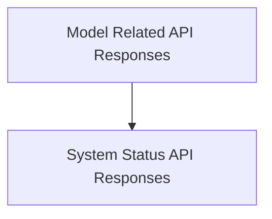

# app_ui_codegen_types Module Documentation

## Introduction

The `app_ui_codegen_types` module defines the core data structures and response types used within the application's user interface (UI) for interacting with backend services. These types are automatically generated and ensure strong typing and consistency across the UI codebase when handling API responses.

## Architecture Overview

This module primarily consists of various response classes that encapsulate data returned from different API endpoints. These classes provide a structured way to parse and consume JSON responses, ensuring type safety and ease of use in the UI components.

<!-- DIAGRAM_JSON
{
    "direction": "TD",
    "nodes": [
        {"id": "model_related_responses", "label": "Model Related API Responses", "type": "module", "link": "model_related_responses.md"},
        {"id": "system_status_responses", "label": "System Status API Responses", "type": "module", "link": "system_status_responses.md"}
    ],
    "edges": [
        {"source": "model_related_responses", "target": "system_status_responses", "label": "uses"}
    ],
    "groups": []
}
-->

## High-Level Functionality

### [Model Related API Responses](model_related_responses.md)
This sub-module defines data structures for responses related to models, including model lists and upstream status. It includes classes like `ModelsResponse` for handling collections of model data and `ModelUpstreamResponse` for indicating the status of model synchronization or updates.

### [System Status API Responses](system_status_responses.md)
This sub-module defines data structures for responses related to system health and settings. It includes classes such as `SettingsResponse` for application configuration and `HealthResponse` for conveying the overall health status of the backend services.
