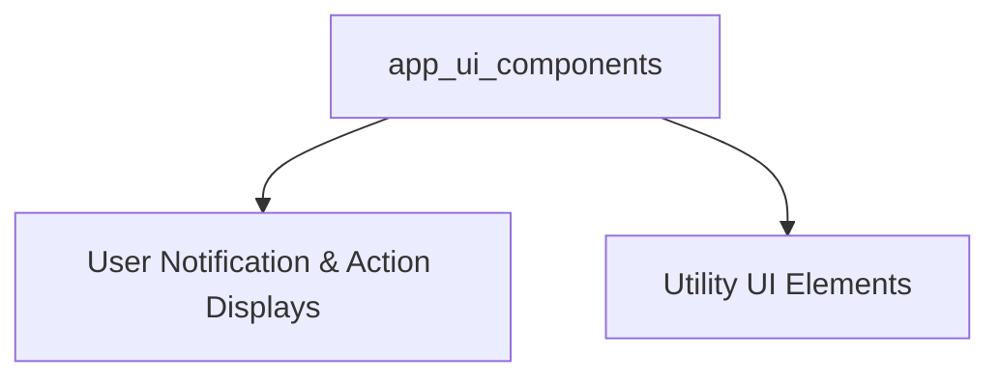

# app_ui_components Module Documentation

## Introduction

The `app_ui_components` module provides a collection of reusable user interface components for the application. These components are designed to handle various aspects of the user experience, from displaying critical information and status updates to managing layout and media.

## Architecture Overview

The `app_ui_components` module is structured into logical sub-modules, each focusing on a specific area of UI functionality. This modular approach enhances maintainability and allows for independent development and testing of UI elements.

<!-- DIAGRAM_JSON
{
    "direction": "TD",
    "nodes": [
        {"id": "app_ui_components_module", "label": "app_ui_components", "type": "module"},
        {"id": "display_components", "label": "User Notification & Action Displays", "type": "module", "link": "display_components.md"},
        {"id": "utility_ui_components", "label": "Utility UI Elements", "type": "module", "link": "utility_ui_components.md"}
    ],
    "edges": [
        {"source": "app_ui_components_module", "target": "display_components"},
        {"source": "app_ui_components_module", "target": "utility_ui_components"}
    ],
    "groups": []
}
-->

## Sub-modules

This module is composed of the following sub-modules:

### [User Notification & Action Displays](display_components.md)
This sub-module contains components for displaying various messages, alerts, and user-actionable prompts, including login, upgrade, and model update notifications.

### [Utility UI Elements](utility_ui_components.md)
This sub-module includes UI components for specific functionalities such as download progress visualization, image display, and application layout structures.
