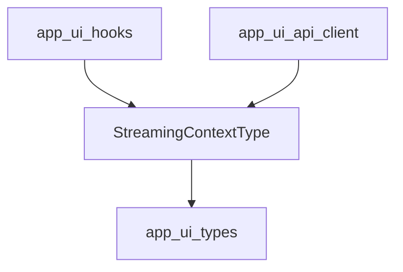

# Module: app_ui_contexts

## Introduction

The `app_ui_contexts` module is a vital part of the application's user interface layer, specifically designed to manage and expose global UI states related to real-time operations such as chat streaming and file downloads. It centralizes the management of these dynamic states, allowing different UI components to consistently access and update information about ongoing background processes.

## Comprehensive Documentation

### Purpose and Core Functionality

The primary purpose of the `app_ui_contexts` module is to provide well-defined React Contexts that encapsulate and control critical UI states. Currently, its core functionality is represented by the `StreamingContextType` interface, which dictates the structure for a context handling streaming chats and downloads. This includes:

*   **Tracking Active Streams**: Maintaining a collection of IDs for chat sessions that are actively streaming content to the user interface.
*   **Managing Loading States**: Identifying chat sessions or resources that are currently in a loading phase, providing visual feedback to the user.
*   **Controlling Operations**: Storing `AbortController` instances to enable the cancellation of ongoing streaming or download tasks, enhancing user control over long-running operations.
*   **Monitoring Download Progress**: Keeping detailed track of the progress of active downloads, using specific event types (`DownloadEvent`) to convey granular information to the UI.

By standardizing these state management patterns through contexts, the module promotes a decoupled and maintainable UI architecture where components can subscribe to and react to global state changes without direct prop passing or complex state lifting.

### Architecture and Component Relationships

The `app_ui_contexts` module, with `StreamingContextType` as its central definition, forms a foundational layer for managing asynchronous UI states.

#### `StreamingContextType`

The `StreamingContextType` interface (defined in `app/ui/app/src/contexts/StreamingContext.tsx`) specifies the shape of the data that will be provided by a React Context. It includes:

*   `streamingChatIds`: A `Set<string>` to store unique identifiers of chats actively receiving streaming data.
*   `setStreamingChatIds`: A `Dispatch<SetStateAction<Set<string>>>` function to update the `streamingChatIds` state.
*   `loadingChats`: A `Set<string>` to store unique identifiers of chats that are currently loading or processing.
*   `setLoadingChats`: A `Dispatch<SetStateAction<Set<string>>>` function to update the `loadingChats` state.
*   `abortControllers`: A `Map<string, AbortController>` to store `AbortController` instances, mapped by an operation ID, allowing for cancellation of corresponding operations.
*   `setAbortControllers`: A `Dispatch<SetStateAction<Map<string, AbortController>>>` function to update the `abortControllers` state.
*   `downloadProgress`: A `Map<string, DownloadEvent>` to store download progress information, mapped by a download ID. The `DownloadEvent` type is expected to provide details about the download status.
*   `setDownloadProgress`: A `Dispatch<SetStateAction<Map<string, DownloadEvent>>>` function to update the `downloadProgress` state.

#### Dependencies

This module has several key dependencies within the application's UI ecosystem:

*   **app_ui_hooks**: Custom React hooks (defined in [app_ui_hooks.md](app_ui_hooks.md)) will likely consume the contexts defined here to provide simplified access to streaming and download states for functional components.
*   **app_ui_api_client**: The API client module (documented in [app_ui_api_client.md](app_ui_api_client.md)) is expected to interact with backend services for streaming chats and file downloads. It would update the states managed by `app_ui_contexts` as operations progress or complete.
*   **app_ui_types**: This module (see [app_ui_types.md](app_ui_types.md)) is a likely source for type definitions such as `DownloadEvent`, which are critical for the correct typing and understanding of the data within `StreamingContextType`.

### How the module fits into the overall system

The `app_ui_contexts` module serves as a critical infrastructure piece for the application's frontend. It enables a robust and efficient way to manage global, dynamic UI states, particularly those associated with real-time data flows and background tasks. By providing a centralized and accessible mechanism for state management, it ensures that:

*   **Consistency**: All parts of the UI that display streaming or download status will reflect the same, up-to-date information.
*   **Responsiveness**: The UI can immediately react to changes in streaming status or download progress, providing a smooth user experience.
*   **Maintainability**: Developers can easily understand where and how streaming and download states are managed, simplifying debugging and feature development.
*   **Scalability**: As new features requiring streaming or download capabilities are added, they can leverage the existing context infrastructure without needing to re-implement state management logic.

It is a foundational layer that underpins the interactive and dynamic capabilities of the application's user interface, allowing for complex asynchronous operations to be presented clearly and managed effectively.

<!-- DIAGRAM_JSON
{
    "direction": "TD",
    "nodes": [
        {"id": "streaming_context_type", "label": "StreamingContextType", "type": "component", "link": null},
        {"id": "app_ui_hooks", "label": "app_ui_hooks", "type": "external", "link": "app_ui_hooks.md"},
        {"id": "app_ui_api_client", "label": "app_ui_api_client", "type": "external", "link": "app_ui_api_client.md"},
        {"id": "app_ui_types", "label": "app_ui_types", "type": "external", "link": "app_ui_types.md"}
    ],
    "edges": [
        {"source": "app_ui_hooks", "target": "streaming_context_type"},
        {"source": "app_ui_api_client", "target": "streaming_context_type"},
        {"source": "streaming_context_type", "target": "app_ui_types"}
    ],
    "groups": []
}
-->
