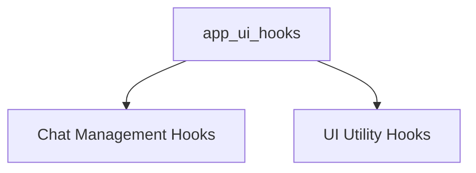

# app_ui_hooks Module Documentation

## Introduction

The `app_ui_hooks` module provides a collection of custom React hooks designed to encapsulate and manage various UI-related logic and interactions within the application. These hooks facilitate state management, asynchronous operations, and component behavior, promoting reusability and maintainability across the user interface.

## Architecture

The `app_ui_hooks` module is organized into several sub-modules, each focusing on a specific area of UI functionality. These sub-modules abstract complex logic, providing a clean and consistent API for UI components to interact with.

<!-- DIAGRAM_JSON
{
    "direction": "TD",
    "nodes": [
        {"id": "app_ui_hooks", "label": "app_ui_hooks", "type": "module"},
        {"id": "chat_management_hooks", "label": "Chat Management Hooks", "type": "module", "link": "chat_management_hooks.md"},
        {"id": "ui_utility_hooks", "label": "UI Utility Hooks", "type": "module", "link": "ui_utility_hooks.md"}
    ],
    "edges": [
        {"source": "app_ui_hooks", "target": "chat_management_hooks"},
        {"source": "app_ui_hooks", "target": "ui_utility_hooks"}
    ],
    "groups": []
}
-->

## Sub-modules

### [Chat Management Hooks](chat_management_hooks.md)
This sub-module provides hooks for managing chat lifecycles, streaming status, model interactions, and basic chat operations like deletion and renaming.

### [UI Utility Hooks](ui_utility_hooks.md)
This sub-module contains general-purpose UI utility hooks, including message autoscrolling, model capability checks, and query batching for performance optimization.
