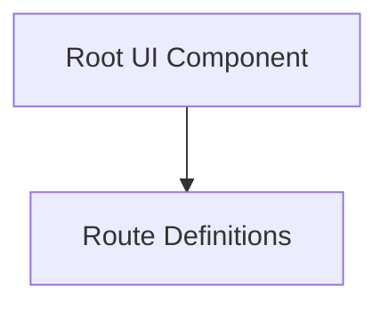

# app_ui_routing Module Documentation

## Introduction

The `app_ui_routing` module is responsible for defining the routing structure and managing the top-level UI components of the application. It ensures that the application's different views and pages are correctly mapped and rendered, providing a consistent navigation experience.

## Architecture Overview

This module primarily consists of components that define the application's routes and a root UI component that serves as the main entry point for the user interface. The root component initializes global application settings and renders the appropriate child routes based on the defined routing tree.

<!-- DIAGRAM_JSON
{
    "direction": "TD",
    "nodes": [
        {"id": "route_definitions", "label": "Route Definitions", "type": "module", "link": "route_definitions.md"},
        {"id": "root_ui_component", "label": "Root UI Component", "type": "module", "link": "root_ui_component.md"}
    ],
    "edges": [
        {"source": "root_ui_component", "target": "route_definitions"}
    ],
    "groups": []
}
-->

## Sub-modules

### [Root UI Component](root_ui_component.md)
This sub-module contains the main root component (`RootComponent`) that serves as the entry point for the application's UI. It handles initial data fetching, such as application settings and cloud status, and uses the routing system to render the appropriate child components via the `<Outlet />`.

### [Route Definitions](route_definitions.md)
This sub-module is responsible for defining the explicit types and structure of the application's routes. It includes `FileRouteTypes` which maps full paths, IDs, and navigation targets for the entire routing tree, ensuring type-safe navigation and route management.