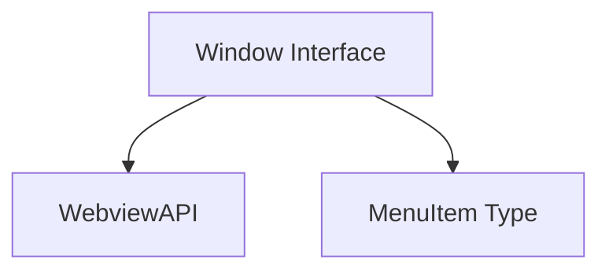

# app_ui_types Module Documentation

## Introduction

The `app_ui_types` module is dedicated to defining fundamental type interfaces and structures used across the application's user interface within a webview environment. Its primary role is to provide type safety and clarity for global objects and interaction points between the webview frontend and native application functionalities.

## Purpose and Core Functionality

This module is crucial for establishing a clear contract between the webview frontend and the underlying native or backend functionalities exposed through a `WebviewAPI`. By defining these types, `app_ui_types` ensures type safety and predictable interactions for UI elements and system-level operations like drag-and-drop, context menus, and feature toggles.

The core component of this module is the `Window` interface, which extends the global `Window` object with webview-specific properties and methods. This interface is defined in `app.ui.app.src.types.webview.d.ts`:

```typescript
interface Window {
    webview?: WebviewAPI;
    drag?: () => void;
    doubleClick?: () => void;
    menu: (items: MenuItem[]) => Promise<string | null>;
    OLLAMA_TOOLS?: boolean;
    OLLAMA_WEBSEARCH?: boolean;
}
```

Each property of the `Window` interface serves a specific purpose:

*   **`webview?: WebviewAPI;`**: An optional property that provides access to a `WebviewAPI` instance. This API is the primary channel for the webview to communicate with the native application or a JavaScript bridge, enabling functionality beyond standard browser capabilities. For more details on the `WebviewAPI` implementation, refer to the [app_webview_api module documentation](app_webview_api.md).
*   **`drag?: () => void;`**: An optional function to initiate a drag operation, commonly used for draggable window elements.
*   **`doubleClick?: () => void;`**: An optional function to handle double-click events, often used for window title bar interactions like maximizing or restoring.
*   **`menu: (items: MenuItem[]) => Promise<string | null>;`**: A required function that allows the webview to display a native context menu. It takes an array of `MenuItem` objects, defining the menu's structure and actions, and returns a promise that resolves with the ID of the selected menu item, or `null` if no item is selected.
*   **`OLLAMA_TOOLS?: boolean;`**: An optional feature flag indicating whether Ollama tools are enabled within the application. This flag can control the visibility or behavior of UI elements related to Ollama functionalities.
*   **`OLLAMA_WEBSEARCH?: boolean;`**: An optional feature flag indicating whether Ollama web search is enabled. Similar to `OLLAMA_TOOLS`, this flag helps in dynamically adjusting the UI and feature availability based on configuration.

## Architecture and Component Relationships

The `app_ui_types` module, through its `Window` interface, acts as a central type definition point for UI-related interactions within the webview. It defines the contract for how the webview interacts with external systems and internal features.

<!-- DIAGRAM_JSON
{
    "direction": "TD",
    "nodes": [
        {"id": "window_interface", "label": "Window Interface", "type": "component", "link": null},
        {"id": "webview_api", "label": "WebviewAPI", "type": "external", "link": "app_webview_api.md"},
        {"id": "menu_item", "label": "MenuItem Type", "type": "component", "link": null}
    ],
    "edges": [
        {"source": "window_interface", "target": "webview_api"},
        {"source": "window_interface", "target": "menu_item"}
    ],
    "groups": []
}
-->


*   The `Window` interface directly depends on `WebviewAPI` for defining the structure of the webview communication bridge. The actual implementation of `WebviewAPI` is expected to reside in the [app_webview_api module documentation](app_webview_api.md), which handles the practical interface between the webview and the native system.
*   The `menu` function within the `Window` interface relies on the `MenuItem` type. While `MenuItem` is not explicitly defined within the provided `app_ui_types` core components, it is conceptualized as an internal type to `app_ui_types` or a closely related type definition module, defining the structure of items that can be displayed in a context menu.
*   The `drag` and `doubleClick` functions represent direct UI interaction points, likely implemented or triggered by components in `app_ui_components` or `app_ui_hooks` that interact with the webview's native capabilities.
*   The `OLLAMA_TOOLS` and `OLLAMA_WEBSEARCH` flags serve as configuration points that influence the behavior of various UI components across the application, potentially interacting with `app_ui_contexts` for state management or `app_ui_utils` for utility functions that interpret these flags.

## How the Module Fits into the Overall System

The `app_ui_types` module is a foundational piece in the application's frontend architecture. It provides the essential type definitions that govern how the webview interacts with the native environment and external functionalities. By defining a clear, type-safe interface for the global `Window` object, it ensures consistency and reduces errors in the communication layer.

This module's definitions are consumed by:

*   **`app_webview_api`**: To provide the concrete implementation of the `WebviewAPI` that adheres to the defined interface. Refer to [app_webview_api module documentation](app_webview_api.md).
*   **`app_webview_glue`**: Potentially uses these types to bridge between the webview and native code. Refer to [app_webview_glue module documentation](app_webview_glue.md).
*   **`app_ui_components` and `app_ui_hooks`**: Components and hooks that need to interact with native features (e.g., triggering a drag, showing a context menu) or read feature flags will rely on these types for correct usage. Refer to [app_ui_components module documentation](app_ui_components.md) and [app_ui_hooks module documentation](app_ui_hooks.md).
*   **Other UI modules**: Any module in the `app_ui_` family that needs to understand the capabilities and configuration exposed via the global `Window` object will implicitly or explicitly depend on the types defined here.

In essence, `app_ui_types` acts as the blueprint for the webview's global environment, enabling a robust and maintainable UI by clearly outlining available functionalities and their expected data structures.