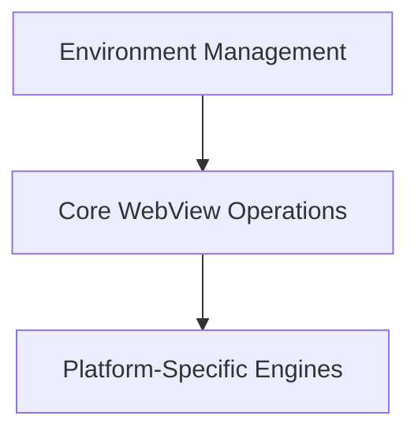

# `app_webview_api` Module Documentation

## Introduction

The `app_webview_api` module provides a cross-platform abstraction layer for embedding web content within an application. It offers a consistent API for managing webview instances, handling their lifecycle, displaying HTML content, and configuring environment-specific settings like DPI awareness and zoom levels. This module is crucial for applications that require integrated web rendering capabilities across macOS, Windows, and Linux (GTK).

## Architecture Overview

The `app_webview_api` module is structured into three main sub-modules, each responsible for a distinct set of functionalities:

1.  **Core WebView Operations (`core_webview_operations`):** Manages the fundamental interactions and lifecycle of the webview, including initialization, content loading, and window property adjustments.
2.  **Platform-Specific Engines (`platform_engines`):** Encapsulates the specific implementations and resource management for different underlying web rendering engines across various operating systems.
3.  **Environment Management (`environment_management`):** Handles environment-specific configurations such as DPI scaling, discovery of available webview clients, and permission handling for client interactions.

These sub-modules interact to provide a seamless webview experience. Core operations delegate to the appropriate platform engine, while environment management sets up the context for both.

<!-- DIAGRAM_JSON
{
    "direction": "TD",
    "nodes": [
        {"id": "core_webview_operations", "label": "Core WebView Operations", "type": "module", "link": "core_webview_operations.md"},
        {"id": "platform_engines", "label": "Platform-Specific Engines", "type": "module", "link": "platform_engines.md"},
        {"id": "environment_management", "label": "Environment Management", "type": "module", "link": "environment_management.md"}
    ],
    "edges": [
        {"source": "core_webview_operations", "target": "platform_engines"},
        {"source": "environment_management", "target": "core_webview_operations"}
    ],
    "groups": []
}
-->

## Sub-modules

### [Core WebView Operations](core_webview_operations.md)
This sub-module centralizes functionalities for managing the lifecycle of the webview, including starting and terminating the webview, dispatching events, and setting basic display properties like title, HTML content, size, and zoom level.

### [Platform-Specific Engines](platform_engines.md)
This sub-module abstracts the differences between various web rendering engines (GTK WebKit, Cocoa WKWebView, Win32 Edge WebView2). It focuses on the initialization, destruction, and specific management details pertinent to each platform's webview implementation.

### [Environment Management](environment_management.md)
Responsible for configuring the webview's operating environment. This includes enabling DPI awareness for optimal rendering, discovering and managing available webview clients (especially for Windows' WebView2), and handling specific permissions such as clipboard access.
