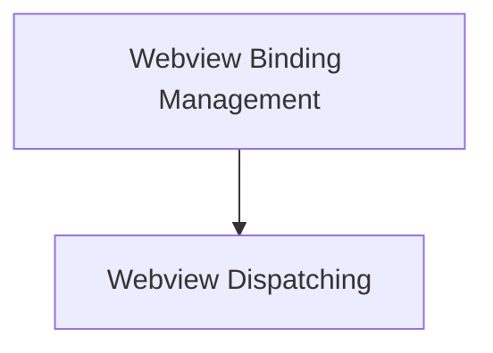

# app_webview_glue Module Documentation

## Introduction

The `app_webview_glue` module serves as the crucial interface between the application's native C/Go backend and the embedded webview component. It provides the necessary functions to dispatch events from the native side to the webview and to bind/unbind JavaScript functions callable from the webview to native C functions.

## Architecture Overview

The module facilitates seamless communication, allowing the native application to control and interact with the web content displayed within the webview. It acts as a bridge, translating calls and events between the two distinct environments.

<!-- DIAGRAM_JSON
{
    "direction": "TD",
    "nodes": [
        {"id": "webview_dispatching", "label": "Webview Dispatching", "type": "module", "link": "webview_dispatching.md"},
        {"id": "webview_binding", "label": "Webview Binding Management", "type": "module", "link": "webview_binding.md"}
    ],
    "edges": [
        {"source": "webview_binding", "target": "webview_dispatching"}
    ],
    "groups": []
}
-->

## Sub-modules

### [Webview Dispatching](webview_dispatching.md)
This sub-module is responsible for handling the dispatching of functions and events from the native application to the webview. It enables the native code to execute JavaScript functions or trigger specific events within the webview environment.

### [Webview Binding Management](webview_binding.md)
This sub-module provides the functionality to bind native C functions to JavaScript functions within the webview, allowing JavaScript code to call native functions. Conversely, it also handles the unbinding of these functions when they are no longer needed, ensuring proper resource management and preventing memory leaks.