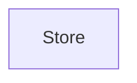

# application_data_settings
This module provides the `Store` component, responsible for managing application-wide data such as unique identifiers, first-run status, user settings, window dimensions, and chat history.

<!-- DIAGRAM_JSON
{
  "nodes": [
    {
      "id": "Store",
      "label": "Store",
      "type": "component"
    }
  ],
  "edges": [],
  "groups": []
}
-->
