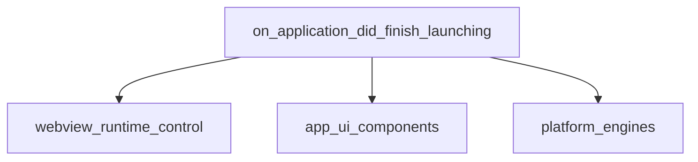

# Module: application_lifecycle_events

## Introduction

The `application_lifecycle_events` module is a crucial component within the `app_webview_api` system, specifically handling events related to the application's startup phase. Its primary function is to manage the `on_application_did_finish_launching` event, ensuring the proper initialization of the application's webview environment, window setup, and activation policies on macOS.

This module acts as a leaf node under `lifecycle_management`, providing specific event handling logic at a critical point in the application's lifecycle.

## Architecture and Component Relationships

The `application_lifecycle_events` module's core functionality revolves around the `on_application_did_finish_launching` component. This component orchestrates several key operations, interacting with other modules to ensure a smooth application launch.

<!-- DIAGRAM_JSON
{
    "direction": "TD",
    "nodes": [
        {"id": "on_application_did_finish_launching", "label": "on_application_did_finish_launching", "type": "component", "link": null},
        {"id": "webview_runtime_control", "label": "webview_runtime_control", "type": "external", "link": "webview_runtime_control.md"},
        {"id": "app_ui_components", "label": "app_ui_components", "type": "external", "link": "app_ui_components.md"},
        {"id": "platform_engines", "label": "platform_engines", "type": "external", "link": "platform_engines.md"}
    ],
    "edges": [
        {"source": "on_application_did_finish_launching", "target": "webview_runtime_control"},
        {"source": "on_application_did_finish_launching", "target": "app_ui_components"},
        {"source": "on_application_did_finish_launching", "target": "platform_engines"}
    ],
    "groups": []
}
-->



### Components

#### `on_application_did_finish_launching`

This is the core and sole component of the `application_lifecycle_events` module. It is triggered when the application has completed its initial launch process. Its responsibilities include:

*   **Run Loop Management**: If the application owns its window, it stops the main run loop to allow for specific initialization sequences to complete.
*   **Application Activation**: Determines if the application is bundled. If not, it programmatically sets the application's activation policy to `NSApplicationActivationPolicyRegular` and activates the app, ensuring it gains focus.
*   **Window Setup**: Calls `set_up_window()` to configure and display the main application window.

```c
  void on_application_did_finish_launching(id /*delegate*/, id app) {
    // See comments related to application lifecycle in create_app_delegate().
    if (m_owns_window) {
      // Stop the main run loop so that we can return
      // from the constructor.
      stop_run_loop();
    }

    // Activate the app if it is not bundled.
    // Bundled apps launched from Finder are activated automatically but
    // otherwise not. Activating the app even when it has been launched from
    // Finder does not seem to be harmful but calling this function is rarely
    // needed as proper activation is normally taken care of for us.
    // Bundled apps have a default activation policy of
    // NSApplicationActivationPolicyRegular while non-bundled apps have a
    // default activation policy of NSApplicationActivationPolicyProhibited.
    if (!is_app_bundled()) {
      // "setActivationPolicy:" must be invoked before
      // "activateIgnoringOtherApps:" for activation to work.
      objc::msg_send<void>(app, "setActivationPolicy:"_sel,
                           NSApplicationActivationPolicyRegular);
      // Activate the app regardless of other active apps.
      // This can be obtrusive so we only do it when necessary.
      objc::msg_send<void>(app, "activateIgnoringOtherApps:"_sel, YES);
    }

    set_up_window();
  }
```

### External Dependencies

*   **[webview_runtime_control](webview_runtime_control.md)**: This module is likely responsible for providing functionalities related to controlling the application's runtime, such as the `stop_run_loop()` function called during launch.
*   **[app_ui_components](app_ui_components.md)**: The `set_up_window()` function, critical for initializing the application's visual interface, relies on components or utilities provided by this module.
*   **[platform_engines](platform_engines.md)**: Handles platform-specific interactions, particularly the Objective-C runtime calls (`objc::msg_send`) used for managing macOS application activation policies.

## System Integration

The `application_lifecycle_events` module is nested within the `app_webview_api`'s `lifecycle_management` submodule, under `core_webview_operations`. This placement signifies its role as a specialized handler for application-level events within the broader webview API. It ensures that the webview component is properly initialized and activated in the macOS environment immediately after the application finishes launching. Its proper functioning is critical for the application's initial display and user interaction.

This module serves as a bridge between the operating system's application lifecycle notifications and the internal setup procedures required by the webview framework, ensuring the application starts correctly and is ready for use.