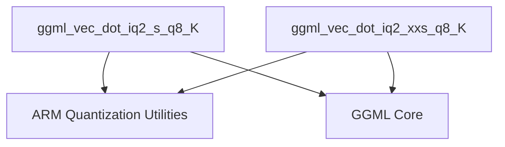

# arm_iq2_vector_dots

This module provides highly optimized, ARM NEON-accelerated implementations for vector dot product operations involving IQ2 (integer quantization level 2) quantized data, specifically in combination with Q8_K quantization. It is a critical component within the GGML library for enabling efficient inference on ARM-based CPUs by leveraging low-level hardware optimizations.

## Architecture and Component Relationships

This module is a leaf module within the `ggml_cpu_arm_quants` hierarchy, specifically nested under `iq2_s_xxs_quantization`. It contains two core functions, `ggml_vec_dot_iq2_s_q8_K` and `ggml_vec_dot_iq2_xxs_q8_K`, which perform the specialized dot product computations.

<!-- DIAGRAM_JSON
{
    "direction": "TD",
    "nodes": [
        {"id": "iq2_s_q8_K", "label": "ggml_vec_dot_iq2_s_q8_K", "type": "component", "link": null},
        {"id": "iq2_xxs_q8_K", "label": "ggml_vec_dot_iq2_xxs_q8_K", "type": "component", "link": null},
        {"id": "ggml_cpu_arm_quants", "label": "ARM Quantization Utilities", "type": "external", "link": "ggml_cpu_arm_quants.md"},
        {"id": "ggml_core", "label": "GGML Core", "type": "external", "link": "ggml_core.md"}
    ],
    "edges": [
        {"source": "iq2_s_q8_K", "target": "ggml_cpu_arm_quants"},
        {"source": "iq2_s_q8_K", "target": "ggml_core"},
        {"source": "iq2_xxs_q8_K", "target": "ggml_cpu_arm_quants"},
        {"source": "iq2_xxs_q8_K", "target": "ggml_core"}
    ],
    "groups": []
}
-->



## Core Functionality

This module encapsulates highly optimized vector dot product routines for specific quantization types, leveraging ARM NEON intrinsics for performance. These functions are crucial for the efficient execution of quantized neural network models on ARM architectures.

### `ggml_vec_dot_iq2_s_q8_K`

```c
void ggml_vec_dot_iq2_s_q8_K(int n, float * GGML_RESTRICT s, size_t bs, const void * GGML_RESTRICT vx, size_t bx, const void * GGML_RESTRICT vy, size_t by, int nrc);
```

This function computes the dot product of two quantized vectors, `vx` and `vy`, where `vx` is represented using `block_iq2_s` quantization and `vy` uses `block_q8_K` quantization. The computation is optimized for ARM NEON, performing block-wise operations to dequantize and multiply vector elements, and then accumulate the results. It uses precomputed grids (`iq2s_grid`) and scales for efficient lookup and scaling.

-   **Parameters:**
    -   `n`: The total number of elements in the vectors.
    -   `s`: Pointer to the output float where the dot product result will be stored.
    -   `bs`, `bx`, `by`: Block sizes, typically `QK_K` for `ggml` quantization blocks.
    -   `vx`: Pointer to the first vector, quantized as `block_iq2_s`.
    -   `vy`: Pointer to the second vector, quantized as `block_q8_K`.
    -   `nrc`: Number of row columns, expected to be 1.

### `ggml_vec_dot_iq2_xxs_q8_K`

```c
void ggml_vec_dot_iq2_xxs_q8_K(int n, float * GGML_RESTRICT s, size_t bs, const void * GGML_RESTRICT vx, size_t bx, const void * GGML_RESTRICT vy, size_t by, int nrc);
```

Similar to `ggml_vec_dot_iq2_s_q8_K`, this function calculates the dot product of two quantized vectors. However, `vx` in this case is represented using `block_iq2_xxs` quantization, while `vy` still uses `block_q8_K`. It also heavily utilizes ARM NEON intrinsics for performance, employing specialized grids (`iq2xxs_grid`) and sign information (`keven_signs_q2xs`) for its dequantization and multiplication steps.

-   **Parameters:**
    -   `n`: The total number of elements in the vectors.
    -   `s`: Pointer to the output float where the dot product result will be stored.
    -   `bs`, `bx`, `by`: Block sizes, typically `QK_K` for `ggml` quantization blocks.
    -   `vx`: Pointer to the first vector, quantized as `block_iq2_xxs`.
    -   `vy`: Pointer to the second vector, quantized as `block_q8_K`.
    -   `nrc`: Number of row columns, expected to be 1.

## Relationship to Overall System

This module is a foundational part of the `ggml` CPU backend, specifically targeting ARM architectures. It provides highly optimized primitive operations (vector dot products) that are essential for the performance of quantized neural networks, particularly large language models. By implementing these operations using ARM NEON intrinsics, it significantly accelerates the matrix multiplication and attention mechanisms that form the backbone of these models, leading to faster inference times and lower power consumption on compatible hardware. It integrates with other quantization-specific modules under [ggml_cpu_arm_quants](ggml_cpu_arm_quants.md) and relies on core definitions and utilities from [ggml_core](ggml_core.md).
