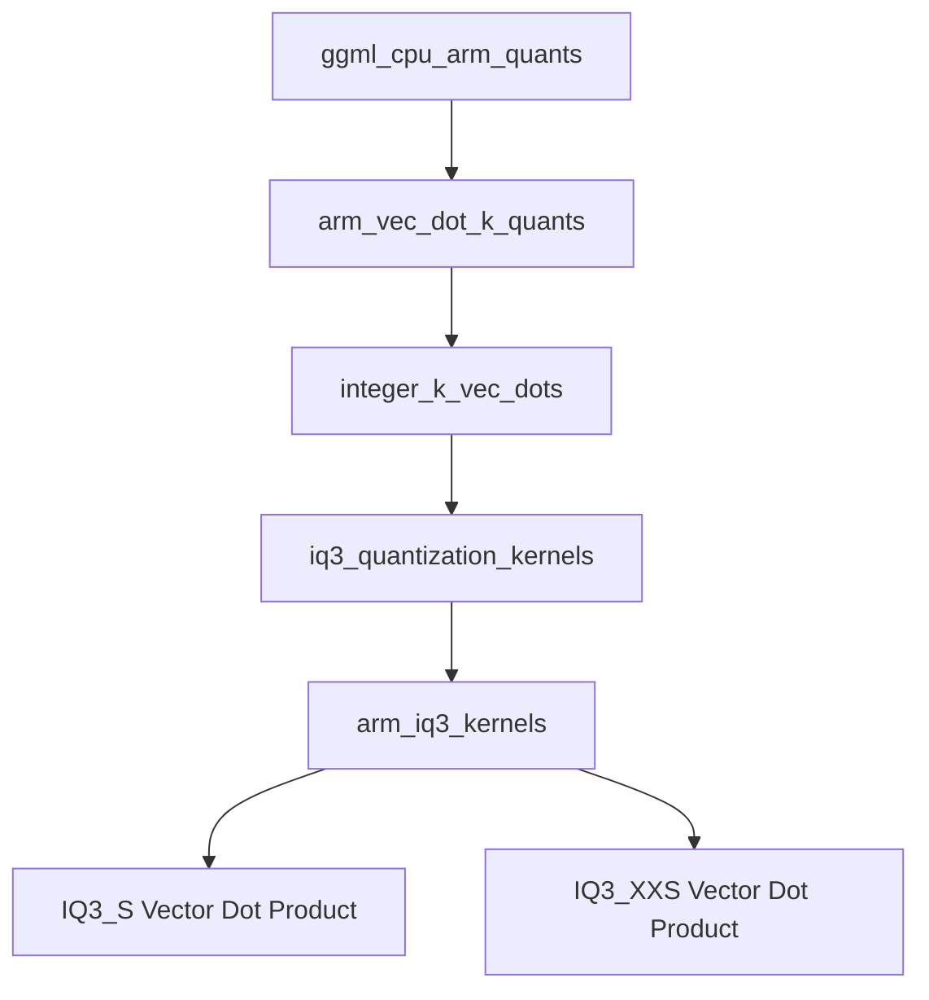

# arm_iq3_kernels Module Documentation

## Introduction and Purpose
The `arm_iq3_kernels` module provides highly optimized vector dot product kernels specifically designed for ARM NEON architectures, implementing IQ3 quantization schemes. These kernels are critical for efficient inference with quantized models on ARM-based processors, accelerating computations by leveraging specific hardware capabilities for `IQ3_S` and `IQ3_XXS` quantization types.

This module is a core component within the larger GGML CPU ARM quantizations framework, nestled under `ggml_cpu_arm_quants`, `arm_vec_dot_k_quants`, `integer_k_vec_dots`, and `iq3_quantization_kernels`. It focuses on the low-level numerical operations that underpin many machine learning model inference tasks.

## Architecture Overview
The `arm_iq3_kernels` module is composed of specialized sub-modules, each handling a specific IQ3 quantization variant. It sits within a hierarchical structure of quantization kernels, providing the final, architecture-specific implementations for ARM NEON.

<!-- DIAGRAM_JSON
{
    "direction": "TD",
    "nodes": [
        {"id": "ggml_cpu_arm_quants", "label": "ggml_cpu_arm_quants", "type": "module", "link": "ggml_cpu_arm_quants.md"},
        {"id": "arm_vec_dot_k_quants", "label": "arm_vec_dot_k_quants", "type": "module", "link": "arm_vec_dot_k_quants.md"},
        {"id": "integer_k_vec_dots", "label": "integer_k_vec_dots", "type": "module", "link": "integer_k_vec_dots.md"},
        {"id": "iq3_quantization_kernels", "label": "iq3_quantization_kernels", "type": "module", "link": "iq3_quantization_kernels.md"},
        {"id": "arm_iq3_kernels", "label": "arm_iq3_kernels", "type": "module"},
        {"id": "iq3_s_kernel", "label": "IQ3_S Vector Dot Product", "type": "module", "link": "iq3_s_kernel.md"},
        {"id": "iq3_xxs_kernel", "label": "IQ3_XXS Vector Dot Product", "type": "module", "link": "iq3_xxs_kernel.md"}
    ],
    "edges": [
        {"source": "ggml_cpu_arm_quants", "target": "arm_vec_dot_k_quants"},
        {"source": "arm_vec_dot_k_quants", "target": "integer_k_vec_dots"},
        {"source": "integer_k_vec_dots", "target": "iq3_quantization_kernels"},
        {"source": "iq3_quantization_kernels", "target": "arm_iq3_kernels"},
        {"source": "arm_iq3_kernels", "target": "iq3_s_kernel"},
        {"source": "arm_iq3_kernels", "target": "iq3_xxs_kernel"}
    ],
    "groups": []
}
-->

## Sub-modules

This module is logically divided into the following sub-modules, each focusing on a specific aspect of IQ3 quantization for ARM NEON:

*   **[IQ3_S Vector Dot Product](iq3_s_kernel.md)**: Implements the IQ3_S quantization kernel for ARM NEON, performing vector dot products with specific scaling and sign handling.

*   **[IQ3_XXS Vector Dot Product](iq3_xxs_kernel.md)**: Provides the IQ3_XXS quantization kernel for ARM NEON, optimized for vector dot products with a distinct scaling and sign processing approach.
