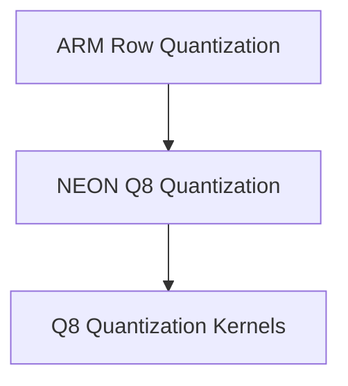

# ARM Q8 Quantization Kernels

This module provides highly optimized ARM Neon kernels for quantizing floating-point data into Q8-0 and Q8-1 formats. These kernels are crucial for efficient memory usage and faster computation in machine learning models running on ARM-based CPUs, particularly within the GGML library.

## Architecture Overview

This module primarily focuses on the low-level implementation of quantization routines. It is a sub-module of `neon_q8_quantization`, which in turn is part of `arm_row_quantization` within the broader `ggml_cpu_arm_quants` module. The kernels provided here directly interact with raw floating-point data to produce quantized integer representations.

<!-- DIAGRAM_JSON
{
    "direction": "TD",
    "nodes": [
        {"id": "arm_row_quantization", "label": "ARM Row Quantization", "type": "module", "link": "arm_row_quantization.md"},
        {"id": "neon_q8_quantization", "label": "NEON Q8 Quantization", "type": "module", "link": "neon_q8_quantization.md"},
        {"id": "q8_quantization_kernels", "label": "Q8 Quantization Kernels", "type": "module", "link": "q8_quantization_kernels.md"}
    ],
    "edges": [
        {"source": "arm_row_quantization", "target": "neon_q8_quantization"},
        {"source": "neon_q8_quantization", "target": "q8_quantization_kernels"}
    ],
    "groups": []
}
-->

## Sub-modules

- **[Q8 Quantization Kernels](q8_quantization_kernels.md)**: This sub-module contains the core ARM Neon optimized functions for quantizing floating-point rows into Q8-0 and Q8-1 formats. It includes `quantize_row_q8_0` and `quantize_row_q8_1` functions.
