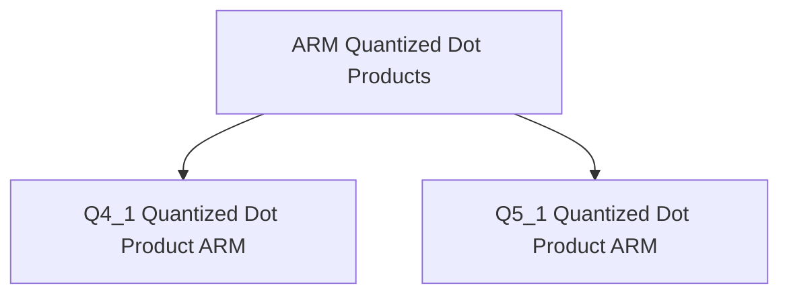
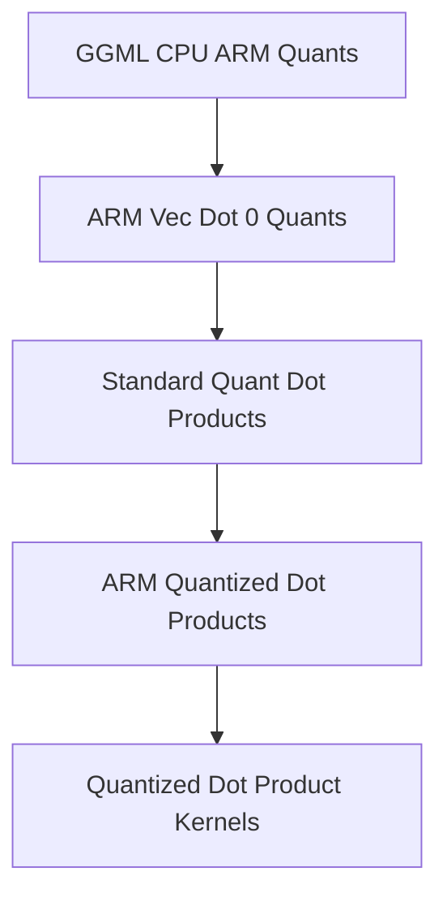

# ARM Quantized Dot Products Module
# arm_quantized_dot_products Module

## Introduction

The `arm_quantized_dot_products` module provides highly optimized implementations of quantized dot product operations specifically for ARM architectures. These operations are crucial for efficient execution of machine learning models on ARM-based devices, particularly for quantized neural networks where performance is critical. The module leverages ARM's NEON intrinsics and, where available, the ARM_FEATURE_MATMUL_INT8 for accelerated computation.

## Architecture

The `arm_quantized_dot_products` module is composed of specialized functions, each tailored to a specific quantization scheme. The current sub-modules handle dot products for Q4_1-Q8_1 and Q5_1-Q8_1 quantized block types, forming a core part of the `ggml-cpu` backend for ARM platforms.

<!-- DIAGRAM_JSON
{
    "direction": "TD",
    "nodes": [
        {"id": "q4_1_dot_product_arm", "label": "Q4_1 Quantized Dot Product ARM", "type": "module", "link": "q4_1_dot_product_arm.md"},
        {"id": "q5_1_dot_product_arm", "label": "Q5_1 Quantized Dot Product ARM", "type": "module", "link": "q5_1_dot_product_arm.md"}
    ],
    "edges": [
        {"source": "arm_quantized_dot_products", "target": "q4_1_dot_product_arm"},
        {"source": "arm_quantized_dot_products", "target": "q5_1_dot_product_arm"}
    ],
    "groups": []
}
-->

## Sub-modules

This module contains the following sub-modules:

*   [Q4_1 Quantized Dot Product ARM](q4_1_dot_product_arm.md): Implements the quantized dot product for Q4_1 and Q8_1 block types optimized for ARM architecture, with optional support for ARM_FEATURE_MATMUL_INT8.
*   [Q5_1 Quantized Dot Product ARM](q5_1_dot_product_arm.md): Provides the quantized dot product for Q5_1 and Q8_1 block types, optimized for ARM architecture using NEON intrinsics.

# arm_quantized_dot_products Module

## Introduction

The `arm_quantized_dot_products` module provides highly optimized implementations of quantized dot product operations specifically for ARM architectures. These operations are crucial for efficient execution of machine learning models on ARM-based devices, particularly for quantized neural networks where performance is critical. The module leverages ARM's NEON intrinsics and, where available, the ARM_FEATURE_MATMUL_INT8 for accelerated computation.

## Architecture

The `arm_quantized_dot_products` module is composed of specialized functions, each tailored to a specific quantization scheme. The current sub-modules handle dot products for Q4_1-Q8_1 and Q5_1-Q8_1 quantized block types, forming a core part of the `ggml-cpu` backend for ARM platforms.

<!-- DIAGRAM_JSON
{
    "direction": "TD",
    "nodes": [
        {"id": "q4_1_dot_product_arm", "label": "Q4_1 Quantized Dot Product ARM", "type": "module", "link": "q4_1_dot_product_arm.md"},
        {"id": "q5_1_dot_product_arm", "label": "Q5_1 Quantized Dot Product ARM", "type": "module", "link": "q5_1_dot_product_arm.md"}
    ],
    "edges": [
        {"source": "arm_quantized_dot_products", "target": "q4_1_dot_product_arm"},
        {"source": "arm_quantized_dot_products", "target": "q5_1_dot_product_arm"}
    ],
    "groups": []
}
-->

## Sub-modules

This module contains the following sub-modules:

*   [Q4_1 Quantized Dot Product ARM](q4_1_dot_product_arm.md): Implements the quantized dot product for Q4_1 and Q8_1 block types optimized for ARM architecture, with optional support for ARM_FEATURE_MATMUL_INT8.
*   [Q5_1 Quantized Dot Product ARM](q5_1_dot_product_arm.md): Provides the quantized dot product for Q5_1 and Q8_1 block types, optimized for ARM architecture using NEON intrinsics.

## Introduction

The `arm_quantized_dot_products` module is a critical component within the GGML library, specifically designed to accelerate vector dot product computations on ARM-based CPUs. This module provides highly optimized kernels for various quantized data types, leveraging ARM NEON and SVE (Scalable Vector Extension) instructions to achieve significant performance gains. It is essential for efficient inference in machine learning models that utilize quantized weights and activations.

## Architecture

The `arm_quantized_dot_products` module is part of a larger hierarchy within the `ggml_cpu_arm_quants` module. It resides under `standard_quant_dot_products` which in turn is a sub-module of `arm_vec_dot_0_quants`. This structured approach ensures a clear separation of concerns and facilitates specialized optimizations for different quantization schemes.

<!-- DIAGRAM_JSON
{
    "direction": "TD",
    "nodes": [
        {"id": "ggml_cpu_arm_quants", "label": "GGML CPU ARM Quants", "type": "external"},
        {"id": "arm_vec_dot_0_quants", "label": "ARM Vec Dot 0 Quants", "type": "external"},
        {"id": "standard_quant_dot_products", "label": "Standard Quant Dot Products", "type": "external"},
        {"id": "arm_quantized_dot_products", "label": "ARM Quantized Dot Products", "type": "module", "link": "arm_quantized_dot_products.md"},
        {"id": "quantized_dot_product_kernels", "label": "Quantized Dot Product Kernels", "type": "module", "link": "quantized_dot_product_kernels.md"}
    ],
    "edges": [
        {"source": "ggml_cpu_arm_quants", "target": "arm_vec_dot_0_quants"},
        {"source": "arm_vec_dot_0_quants", "target": "standard_quant_dot_products"},
        {"source": "standard_quant_dot_products", "target": "arm_quantized_dot_products"},
        {"source": "arm_quantized_dot_products", "target": "quantized_dot_product_kernels"}
    ],
    "groups": []
}
-->

## Sub-modules

### [Quantized Dot Product Kernels](quantized_dot_product_kernels.md)
This sub-module provides highly optimized ARM NEON and SVE kernels for vector dot products involving Q4_0, Q5_0, and Q8_0 quantized data types. It contains the core implementations for efficient computation of dot products between different quantization formats, crucial for performance in quantized machine learning models.
