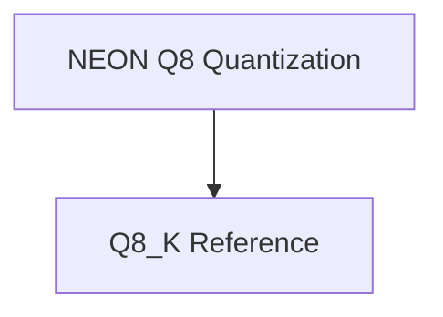

# ARM Row Quantization Module

## Introduction and Purpose

The `arm_row_quantization` module provides highly optimized functions for quantizing rows of floating-point numbers into various Q8 integer formats, specifically tailored for ARM architectures with NEON support. This module is critical for efficient memory usage and faster computation in machine learning models by reducing the precision of numerical data while maintaining acceptable accuracy. It handles the conversion of `float` data to `int8` or similar quantized representations.

## Architecture Overview

The `arm_row_quantization` module is structured into specialized sub-modules to manage different quantization schemes. It leverages ARM NEON intrinsics for performance-critical operations where available, falling back to scalar implementations otherwise.

<!-- DIAGRAM_JSON
{
    "direction": "TD",
    "nodes": [
        {"id": "neon_q8_quantization", "label": "NEON Q8 Quantization", "type": "module", "link": "neon_q8_quantization.md"},
        {"id": "q8_k_reference", "label": "Q8_K Reference", "type": "module", "link": "q8_k_reference.md"}
    ],
    "edges": [
        {"source": "neon_q8_quantization", "target": "q8_k_reference", "label": "Provides optimized variants for"}
    ],
    "groups": []
}
-->

## High-Level Functionality

### [NEON Q8 Quantization](neon_q8_quantization.md)
This sub-module contains functions (`quantize_row_q8_0` and `quantize_row_q8_1`) that perform row quantization for Q8_0 and Q8_1 formats. These functions are highly optimized for ARM processors using NEON intrinsics, significantly speeding up the quantization process for compatible hardware.

### [Q8_K Reference](q8_k_reference.md)
This sub-module includes the `quantize_row_q8_K` function, which serves as a reference or generic implementation for Q8_K row quantization. It typically provides a scalar fallback when specific hardware optimizations are not available or not applicable.
