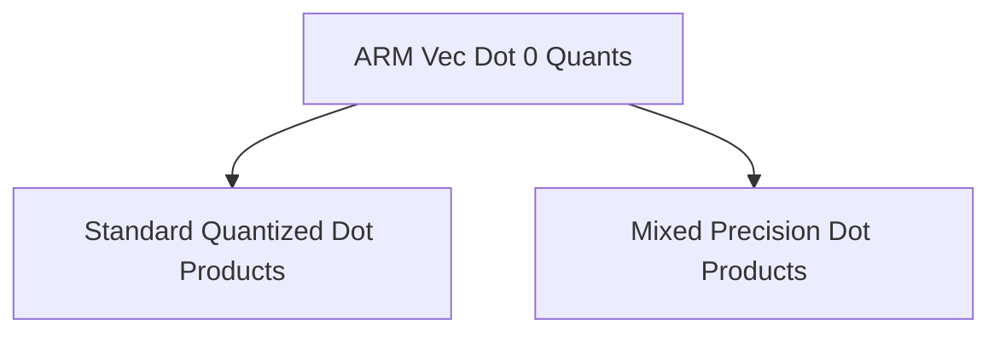

# ARM Vector Dot Product 0 Quantizations (`arm_vec_dot_0_quants`)

## Introduction
The `arm_vec_dot_0_quants` module is a crucial component within the GGML (GGML Machine Learning) library, specifically designed for highly optimized vector dot product operations on ARM-based CPUs. This module implements various quantized vector dot product functions, primarily interacting with `Q8_0` quantized data, and leveraging ARM-specific intrinsics like NEON and SVE to achieve significant performance gains in machine learning inference tasks.

Its core purpose is to accelerate common tensor operations involving quantized data, which are fundamental to efficient execution of neural networks on resource-constrained ARM devices.

## Architecture Overview
The `arm_vec_dot_0_quants` module is structured to provide specialized implementations for different quantization schemes. It acts as an orchestrator, dispatching to highly optimized sub-modules based on the specific quantization formats involved in the vector dot product. The module leverages ARM's SIMD capabilities (NEON and SVE) to process multiple data elements in parallel, leading to faster computation.

The primary sub-modules within `arm_vec_dot_0_quants` are:
- [Standard Quantized Dot Products](standard_quant_dot_products.md)
- [Mixed Precision Dot Products](mixed_precision_dot_products.md)

<!-- DIAGRAM_JSON
{
    "direction": "TD",
    "nodes": [
        {"id": "arm_vec_dot_0_quants", "label": "ARM Vec Dot 0 Quants", "type": "module"},
        {"id": "standard_quant_dot_products", "label": "Standard Quantized Dot Products", "type": "module", "link": "standard_quant_dot_products.md"},
        {"id": "mixed_precision_dot_products", "label": "Mixed Precision Dot Products", "type": "module", "link": "mixed_precision_dot_products.md"}
    ],
    "edges": [
        {"source": "arm_vec_dot_0_quants", "target": "standard_quant_dot_products"},
        {"source": "arm_vec_dot_0_quants", "target": "mixed_precision_dot_products"}
    ],
    "groups": []
}
-->

## Sub-modules

### Standard Quantized Dot Products
This sub-module ([`standard_quant_dot_products.md`](standard_quant_dot_products.md)) encompasses vector dot product implementations for widely used quantization formats such as Q4_0, Q5_0, and Q8_0, typically in conjunction with Q8_0. These functions are highly optimized to leverage ARM CPU features, providing efficient computation for common quantized tensor operations.

### Mixed Precision Dot Products
The mixed precision dot products sub-module ([`mixed_precision_dot_products.md`](mixed_precision_dot_products.md)) focuses on more specialized or experimental quantization types like MXFP4 and IQ4_NL, performing dot products with Q8_0. These implementations extend the module's capabilities to handle a broader range of mixed-precision scenarios, ensuring robust performance across diverse quantization schemes.