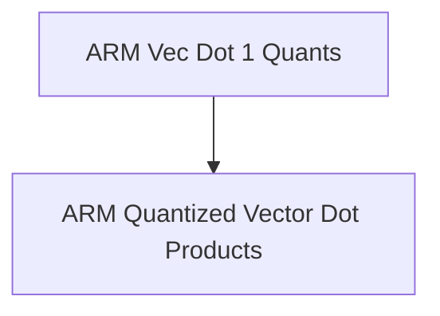

# arm_vec_dot_1_quants Module Documentation

## Introduction
The `arm_vec_dot_1_quants` module, part of the `ggml_cpu_arm_quants` package, is dedicated to providing highly optimized vector dot product implementations for ARM architectures. This module is critical for efficient neural network computations on ARM-based systems by supporting specific quantization schemes. It primarily focuses on dot products involving Q4_1, Q5_1, and Q8_1 quantized data types, leveraging ARM NEON intrinsics and, where available, ARM_FEATURE_MATMUL_INT8 for maximum performance.

## Architecture

<!-- DIAGRAM_JSON
{
    "direction": "TD",
    "nodes": [
        {"id": "arm_vec_dot_1_quants", "label": "ARM Vec Dot 1 Quants", "type": "module"},
        {"id": "quantized_vector_dot_products_arm", "label": "ARM Quantized Vector Dot Products", "type": "module", "link": "quantized_vector_dot_products_arm.md"}
    ],
    "edges": [
        {"source": "arm_vec_dot_1_quants", "target": "quantized_vector_dot_products_arm"}
    ],
    "groups": []
}
-->

The `arm_vec_dot_1_quants` module is composed of the following key sub-module:

### [ARM Quantized Vector Dot Products](quantized_vector_dot_products_arm.md)
This sub-module encapsulates the core logic for performing quantized vector dot products on ARM. It includes functions like `ggml_vec_dot_q4_1_q8_1` and `ggml_vec_dot_q5_1_q8_1`, which are highly optimized for specific quantization formats (Q4_1, Q5_1, and Q8_1) to ensure high-performance computations on ARM CPUs. Its documentation provides detailed information on each component and their specific use cases within the GGML framework.
