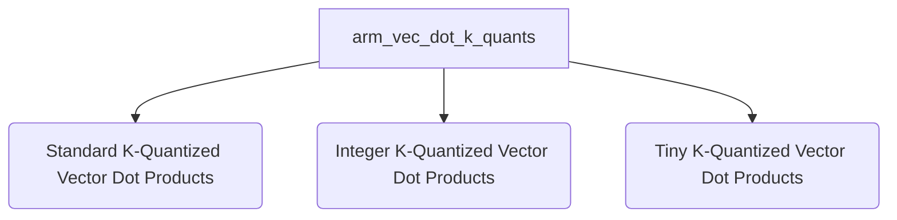

# `arm_vec_dot_k_quants` Module Overview

## Purpose of the Module

The `arm_vec_dot_k_quants` module provides a collection of highly optimized vector dot product implementations specifically tailored for ARM architectures. These functions are crucial for efficient execution of quantized neural networks, enabling faster inference on ARM-based CPUs by performing dot products between various K-quantized data types (such as Q2_K, Q3_K, Q4_K, Q5_K, Q6_K, IQ1_K, IQ2_K, IQ3_K, IQ4_K, TQ1_0, TQ2_0) and Q8_K quantized types. It leverages ARM NEON intrinsics to maximize performance for low-bit and integer quantization schemes.

## Architecture

The `arm_vec_dot_k_quants` module is organized into several sub-modules, each focusing on a specific category of K-quantized vector dot product operations. This modular design allows for specialized optimizations and clear separation of concerns.

## Core Components Documentation

The `arm_vec_dot_k_quants` module encompasses a variety of highly optimized vector dot product functions. Key components include:

*   [`ggml_vec_dot_q4_K_q8_K`](ggml_vec_dot_q4_K_q8_K.md): Computes dot product for Q4_K and Q8_K quantized vectors.
*   [`ggml_vec_dot_q6_K_q8_K`](ggml_vec_dot_q6_K_q8_K.md): Computes dot product for Q6_K and Q8_K quantized vectors.
*   [`ggml_vec_dot_iq2_xs_q8_K`](ggml_vec_dot_iq2_xs_q8_K.md): Computes dot product for IQ2_XS and Q8_K quantized vectors.
*   [`ggml_vec_dot_q5_K_q8_K`](ggml_vec_dot_q5_K_q8_K.md): Computes dot product for Q5_K and Q8_K quantized vectors.
*   [`ggml_vec_dot_iq2_s_q8_K`](ggml_vec_dot_iq2_s_q8_K.md): Computes dot product for IQ2_S and Q8_K quantized vectors.
*   [`ggml_vec_dot_iq3_s_q8_K`](ggml_vec_dot_iq3_s_q8_K.md): Computes dot product for IQ3_S and Q8_K quantized vectors.
*   [`ggml_vec_dot_iq4_xs_q8_K`](ggml_vec_dot_iq4_xs_q8_K.md): Computes dot product for IQ4_XS and Q8_K quantized vectors.
*   [`ggml_vec_dot_q2_K_q8_K`](ggml_vec_dot_q2_K_q8_K.md): Computes dot product for Q2_K and Q8_K quantized vectors.
*   [`ggml_vec_dot_q3_K_q8_K`](ggml_vec_dot_q3_K_q8_K.md): Computes dot product for Q3_K and Q8_K quantized vectors.
*   [`ggml_vec_dot_iq1_m_q8_K`](ggml_vec_dot_iq1_m_q8_K.md): Computes dot product for IQ1_M and Q8_K quantized vectors.
*   [`ggml_vec_dot_iq2_xxs_q8_K`](ggml_vec_dot_iq2_xxs_q8_K.md): Computes dot product for IQ2_XXS and Q8_K quantized vectors.
*   [`ggml_vec_dot_iq3_xxs_q8_K`](ggml_vec_dot_iq3_xxs_q8_K.md): Computes dot product for IQ3_XXS and Q8_K quantized vectors.
*   [`ggml_vec_dot_iq1_s_q8_K`](ggml_vec_dot_iq1_s_q8_K.md): Computes dot product for IQ1_S and Q8_K quantized vectors.
*   [`ggml_vec_dot_tq1_0_q8_K`](ggml_vec_dot_tq1_0_q8_K.md): Computes dot product for TQ1_0 and Q8_K quantized vectors.
*   [`ggml_vec_dot_tq2_0_q8_K`](ggml_vec_dot_tq2_0_q8_K.md): Computes dot product for TQ2_0 and Q8_K quantized vectors.