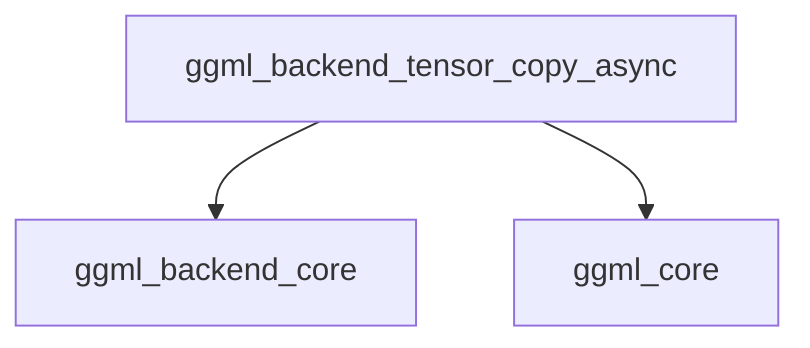

# Asynchronous Tensor Copy Module

## Introduction

The `asynchronous_tensor_copy` module is a crucial component within the GGML backend system, specifically designed to facilitate efficient data transfer between different GGML backends. It primarily provides a mechanism for asynchronously copying tensor data, with a fallback to synchronous copying when asynchronous operations are not supported by the target backend.

## Purpose and Core Functionality

The primary purpose of this module is to enable high-performance data movement of `ggml_tensor` objects across various hardware backends (e.g., CPU, GPU). By prioritizing asynchronous operations, it aims to reduce latency and improve overall system throughput by allowing computation to proceed while data transfers are in progress.

The core functionality is encapsulated in the `ggml_backend_tensor_copy_async` function:

*   **Asynchronous Copy**: If the destination backend (`backend_dst`) provides an asynchronous tensor copy interface (`cpy_tensor_async`), this function will attempt to use it. This allows the copy operation to be non-blocking.
*   **Layout Validation**: Before any copy, it ensures that the source (`src`) and destination (`dst`) tensors have identical memory layouts using `ggml_are_same_layout`. This is critical for data integrity.
*   **Synchronous Fallback**: In cases where the destination backend does not support asynchronous copying, the module gracefully falls back to a synchronous copy mechanism. This involves synchronizing both the source and destination backends (`ggml_backend_synchronize`) and then performing a blocking copy using `ggml_backend_tensor_copy`.

This design ensures that tensor data can always be transferred, regardless of the backend's specific capabilities, while optimizing for performance when possible.

## Architecture and Component Relationships

The `asynchronous_tensor_copy` module is a leaf module that provides a specialized function for tensor data transfer. It interacts closely with the `ggml_backend_core` for backend management and synchronization, and with `ggml_core` for fundamental tensor definitions and utility functions.

**Core Component**

*   `ggml_backend_tensor_copy_async`: This function orchestrates the tensor copy process, handling both asynchronous and synchronous execution paths.

**Dependencies**

*   **ggml_backend_core**: This module provides the `ggml_backend_t` type, backend synchronization mechanisms (`ggml_backend_synchronize`), and the blocking tensor copy function (`ggml_backend_tensor_copy`). It also exposes the `cpy_tensor_async` interface which this module attempts to utilize.
*   **ggml_core**: This module provides the fundamental `ggml_tensor` data structure and utility functions like `ggml_are_same_layout` for validating tensor compatibility.

## System Integration

This module is integral to the `ggml_backend_core`'s `data_transfer_and_comparison.tensor_transfer` sub-module, providing a key mechanism for moving data efficiently between different computation backends. It allows higher-level GGML operations to transfer tensor data without needing to be aware of the underlying hardware-specific copy implementations, promoting modularity and flexibility within the GGML framework. Its role is particularly vital in multi-backend scenarios where tensors might reside on different devices (e.g., CPU and GPU) and need to be moved for subsequent processing.

<!-- DIAGRAM_JSON
{
    "direction": "TD",
    "nodes": [
        {"id": "async_copy_func", "label": "ggml_backend_tensor_copy_async", "type": "component", "link": null},
        {"id": "ggml_backend_core", "label": "ggml_backend_core", "type": "external", "link": "ggml_backend_core.md"},
        {"id": "ggml_core", "label": "ggml_core", "type": "external", "link": "ggml_core.md"}
    ],
    "edges": [
        {"source": "async_copy_func", "target": "ggml_backend_core"},
        {"source": "async_copy_func", "target": "ggml_core"}
    ],
    "groups": []
}
-->
