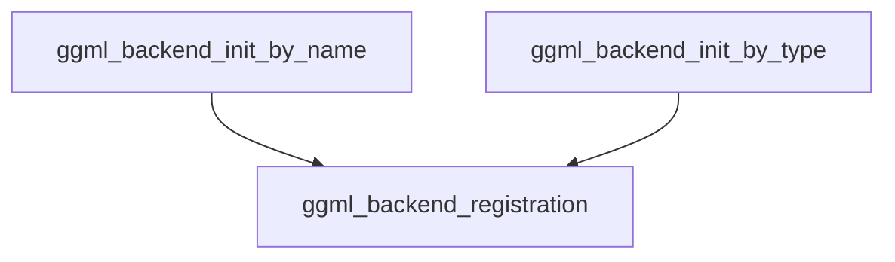

# backend_by_identifier

The `backend_by_identifier` module is crucial for the dynamic initialization of GGML backend instances. It provides a flexible mechanism to instantiate a backend either by its registered name or by its enumerated type, allowing the system to adapt to various hardware accelerators or specialized CPU implementations. This module acts as an interface between high-level requests for backend functionality and the underlying GGML backend registration system.

### Purpose and Core Functionality

This module facilitates the creation of `ggml_backend_t` instances, which represent an initialized GGML backend. Its primary functions are:
-   `ggml_backend_init_by_name`: Initializes a GGML backend using a string identifier. This is useful when the desired backend is known by its human-readable name, typically provided via configuration or command-line arguments.
-   `ggml_backend_init_by_type`: Initializes a GGML backend using its enumerated type. This method is suitable for programmatic selection of backends where specific backend types (e.g., CPU, Metal, CUDA, Vulkan) are targeted.

Both functions rely on retrieving a backend device handle (`ggml_backend_dev_t`) first and then initializing the backend using that handle. If no device is found for the given identifier or type, the initialization fails, returning `nullptr`.

### Architecture and Component Relationships

The `backend_by_identifier` module is a leaf module within the `ggml_backend_registration` hierarchy, specifically under `ggml_backend_registration -> backend_initialization -> backend_initialization_utilities`. It depends on the broader `ggml_backend_registration` module for functions that resolve backend device handles.

<!-- DIAGRAM_JSON
{
    "direction": "TD",
    "nodes": [
        {"id": "init_by_name", "label": "ggml_backend_init_by_name", "type": "component", "link": null},
        {"id": "init_by_type", "label": "ggml_backend_init_by_type", "type": "component", "link": null},
        {"id": "backend_registration", "label": "ggml_backend_registration", "type": "external", "link": "ggml_backend_registration.md"}
    ],
    "edges": [
        {"source": "init_by_name", "target": "backend_registration"},
        {"source": "init_by_type", "target": "backend_registration"}
    ],
    "groups": []
}
-->

### How the Module Fits into the Overall System

The `backend_by_identifier` module is a critical part of the GGML ecosystem's backend abstraction layer. It ensures that different computational backends can be seamlessly integrated and utilized. When a model or application needs to specify a particular backend for computations, it will interact with these functions to get an initialized backend instance. This modularity allows GGML to support various hardware configurations (CPU, GPU via Metal/CUDA/Vulkan) and optimize performance by selecting the most appropriate backend at runtime. It serves as a bridge between the high-level application logic and the low-level backend implementations defined across modules like [ggml_cpu_backend.md], [ggml_backend_metal.md], and [ggml_backend_vulkan.md].
