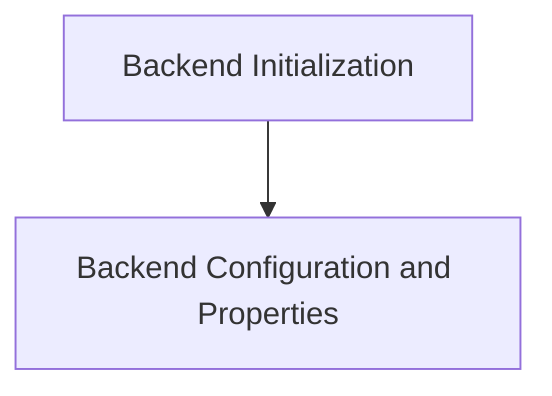

# Backend Initialization and Management

This module is responsible for the initialization, configuration, and management of the BLAS (Basic Linear Algebra Subprograms) backend within the GGML framework. It provides functionalities to set up the backend, configure its operational parameters like the number of threads, and retrieve device-specific properties.

## Architecture Overview

The `backend_initialization_and_management` module interacts with the core BLAS backend to provide essential setup and control mechanisms. It is divided into key sub-modules that handle distinct aspects of backend management, as illustrated below:

<!-- DIAGRAM_JSON
{
    "direction": "TD",
    "nodes": [
        {"id": "backend_initialization", "label": "Backend Initialization", "type": "module", "link": "backend_initialization.md"},
        {"id": "backend_configuration_and_properties", "label": "Backend Configuration and Properties", "type": "module", "link": "backend_configuration_and_properties.md"}
    ],
    "edges": [
        {"source": "backend_initialization", "target": "backend_configuration_and_properties"}
    ],
    "groups": []
}
-->

## Sub-modules

### [Backend Initialization](backend_initialization.md)
This sub-module focuses on the initial setup of the BLAS backend.

### [Backend Configuration and Properties](backend_configuration_and_properties.md)
This sub-module handles the configuration of backend operational parameters and the retrieval of device properties.