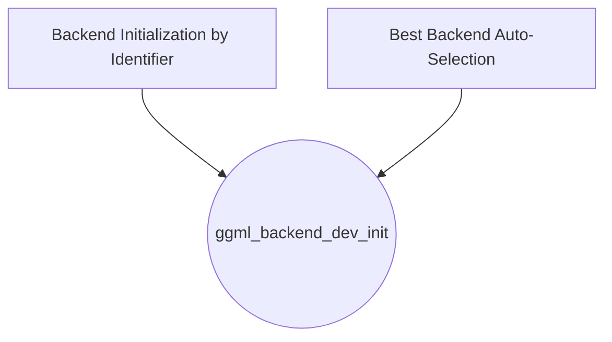

# Backend Initialization Utilities

The `backend_initialization_utilities` module is a critical component within the GGML backend registration system, providing essential functions for initializing various hardware acceleration backends. It acts as an interface to select and set up the most appropriate backend for computations, whether by explicit identification or automatic detection.

## Architecture Overview

This module orchestrates the initialization of different GGML backends, relying on underlying device discovery and setup mechanisms. It provides distinct pathways for backend selection based on specific criteria like name, type, or an automated "best available" approach.

<!-- DIAGRAM_JSON
{
    "direction": "TD",
    "nodes": [
        {"id": "backend_by_identifier", "label": "Backend Initialization by Identifier", "type": "module", "link": "backend_by_identifier.md"},
        {"id": "best_backend_selection", "label": "Best Backend Auto-Selection", "type": "module", "link": "best_backend_selection.md"}
    ],
    "edges": [
        {"source": "backend_by_identifier", "target": "ggml_backend_dev_init"},
        {"source": "best_backend_selection", "target": "ggml_backend_dev_init"}
    ],
    "groups": []
}
-->

## Sub-modules and Functionality

### [Backend Initialization by Identifier](backend_by_identifier.md)
This sub-module encapsulates functions that allow the system to initialize a GGML backend by providing its specific name or device type. This is useful for scenarios where a particular backend is known and needs to be explicitly loaded.

### [Best Backend Auto-Selection](best_backend_selection.md)
This sub-module provides a mechanism to automatically select and initialize the most optimal GGML backend available on the system. It follows a predefined hierarchy, typically prioritizing GPUs, then integrated GPUs, and finally falling back to the CPU, ensuring that the most performant option is utilized when no specific backend is requested.
