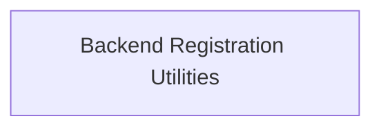

# Backend Management Module

## Introduction
The `backend_management` module is responsible for handling the registration and loading of different GGML backend implementations. It provides core utilities for managing available backends, allowing the system to dynamically discover and utilize various hardware acceleration or specialized processing units.

## Architecture Overview
The `backend_management` module currently consists of a single sub-module: `backend_registration_utilities`. This sub-module encapsulates the functionality for loading all registered backends and retrieving a specific backend by its name.

<!-- DIAGRAM_JSON
{
    "direction": "TD",
    "nodes": [
        {"id": "backend_registration_utilities", "label": "Backend Registration Utilities", "type": "module", "link": "backend_registration_utilities.md"}
    ],
    "edges": [],
    "groups": []
}
-->

## Sub-modules
### Backend Registration Utilities
This sub-module provides the core functions for interacting with the GGML backend registration system. It allows for the loading of all available backends and the lookup of a backend registration entry by its name.
For more details, refer to the [Backend Registration Utilities Documentation](backend_registration_utilities.md).
