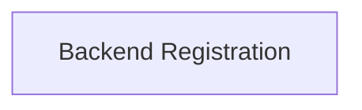

# Backend Registration Utilities

## Introduction and Purpose

The `backend_registration_utilities` module is a crucial component within the `ggml_backend_registration` system. Its primary purpose is to provide core functionalities for managing the registration and loading of various GGML backends. This module acts as an interface for discovering and interacting with available backends, ensuring that the GGML library can dynamically utilize different hardware acceleration or processing implementations.

## Architecture Overview

The `backend_registration_utilities` module is designed to be a lightweight and focused component within the broader backend registration framework. It primarily interacts with the overall backend management system to facilitate the discovery and loading of registered backends.

<!-- DIAGRAM_JSON
{
    "direction": "TD",
    "nodes": [
        {"id": "backend_registration", "label": "Backend Registration", "type": "module", "link": "backend_registration.md"}
    ],
    "edges": [],
    "groups": []
}
-->

## Sub-modules

This module contains the following sub-module:

### [Backend Registration](backend_registration.md)
This sub-module is responsible for managing the registration and loading of GGML backends by name or through a general loading mechanism. It provides functions to iterate through registered backends, retrieve a backend by its name, and load all available backends from a specified path (or default paths if none is provided).
