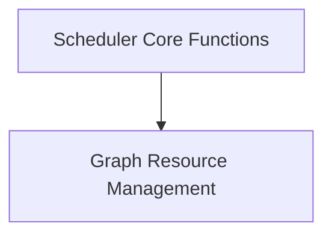

# Backend Scheduling Module

## Introduction
The `backend_scheduling` module is a critical component within the GGML backend, responsible for orchestrating the execution of computation graphs and managing associated memory resources. It provides the core functionality for creating, reserving, and computing graphs efficiently across various backend devices.

## Architecture Overview
The `backend_scheduling` module is designed to abstract away the complexities of device-specific graph execution and resource management. It interacts closely with the `ggml_backend_core` for overall backend operations and leverages other GGML modules for memory allocation and tensor operations. The module is structured into key sub-modules that handle scheduler initialization and graph resource management.

<!-- DIAGRAM_JSON
{
    "direction": "TD",
    "nodes": [
        {"id": "scheduler_core", "label": "Scheduler Core Functions", "type": "module", "link": "scheduler_core.md"},
        {"id": "graph_resource_management", "label": "Graph Resource Management", "type": "module", "link": "graph_resource_management.md"}
    ],
    "edges": [
        {"source": "scheduler_core", "target": "graph_resource_management"}
    ],
    "groups": []
}
-->

## Sub-modules

### [Scheduler Core Functions](scheduler_core.md)
This sub-module focuses on the foundational aspects of the backend scheduler, including its creation and initial configuration. It provides the entry point for setting up a new scheduler instance with specified backend devices and buffer types.

### [Graph Resource Management](graph_resource_management.md)
This sub-module is dedicated to the allocation, reservation, and computation of graphs. It handles the intricate details of preparing the necessary memory for graph execution and orchestrating the actual computation across the assigned backend devices.
