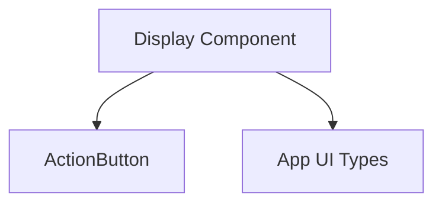

# `base_display_component` Module Documentation

## Introduction

The `base_display_component` module provides a foundational UI component, `Display`, designed for presenting messages to users. This component is highly versatile, supporting various display `variants` (e.g., neutral, success, error) and capable of embedding interactive `actions` such as links or buttons. It serves as a base for more complex display components within the application's user interface, ensuring consistency and reusability in how information and user prompts are presented.

## Architecture and Component Relationships

This module encapsulates the `Display` React component, which internally utilizes an `ActionButton` helper component to render interactive elements. The `Display` component relies on external type definitions to ensure proper prop validation and clear communication of its expected inputs.

<!-- DIAGRAM_JSON
{
    "direction": "TD",
    "nodes": [
        {"id": "display_component", "label": "Display Component", "type": "component", "link": null},
        {"id": "action_button", "label": "ActionButton", "type": "component", "link": null},
        {"id": "app_ui_types", "label": "App UI Types", "type": "external", "link": "app_ui_types.md"}
    ],
    "edges": [
        {"source": "display_component", "target": "action_button"},
        {"source": "display_component", "target": "app_ui_types"}
    ],
    "groups": []
}
-->

## Core Functionality

### `Display` Component

`app.ui.app.src.components.ui.display.Display` is the primary component of this module. It is a functional React component responsible for rendering a message to the user with optional styling and interactive elements. Its key features include:

-   **Message Display**: Renders a `message` string.
-   **Variants**: Supports different visual `variant` styles (e.g., "neutral", "success", "error") to convey the nature of the message.
-   **Dismissal**: Provides an `onDismiss` callback for scenarios where the display can be closed or removed by the user.
-   **Actions**: Can include an `action` object, which, if provided, renders an `ActionButton` for user interaction. This action can be a clickable button or a hyperlink.
-   **Custom Styling**: Accepts a `className` prop for additional styling.

### `ActionButton` (Internal Helper Component)

The `ActionButton` is a helper component nested within `Display`. It is responsible for rendering either an HTML `<a>` tag (for external links) or an HTML `<button>` tag (for internal actions) based on the `action` prop passed to the `Display` component. It also handles the visual feedback for loading states of actions.

## Integration with the Overall System

The `base_display_component` module is a fundamental part of the `app_ui_components.display_components` subsystem, which focuses on presenting information to the user interface. It acts as a low-level building block, providing a consistent and reusable way to display messages and user prompts across the application.

Other modules, particularly those responsible for higher-level UI elements or specific feature displays, can leverage this `Display` component to ensure a unified user experience. For instance, modules needing to show status updates, error notifications, or informational messages will integrate `base_display_component`.

This module's dependency on [app_ui_types](app_ui_types.md) highlights its integration with the application's shared type definitions, ensuring type safety and consistency across the UI codebase. Its placement as a "base" component indicates that other more specialized display components (e.g., `conditional_displays`) might compose or extend its functionality.