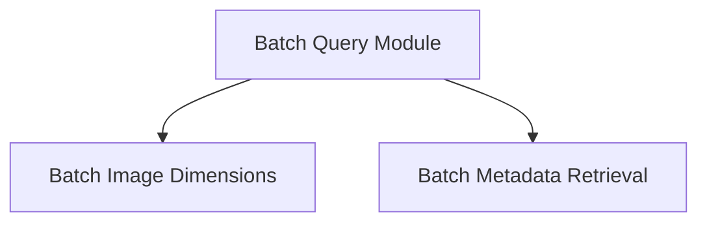

# Batch Query Module Documentation

## Introduction and Purpose

The `batch_query` module is a vital component within the `llama.cpp` CLIP image processing pipeline, specifically designed for efficient retrieval of information from batches of `f32` CLIP images. Its primary purpose is to provide structured access to batch metadata, such as the total number of images, and individual image attributes like width and height, enabling precise manipulation and analysis of image data.

## Architecture Overview

The `batch_query` module is logically divided into two distinct sub-modules, each focusing on a specific aspect of batch information retrieval:

<!-- DIAGRAM_JSON
{
    "direction": "TD",
    "nodes": [
        {"id": "batch_query", "label": "Batch Query Module", "type": "module"},
        {"id": "batch_dimensions", "label": "Batch Image Dimensions", "type": "module", "link": "batch_dimensions.md"},
        {"id": "batch_metadata", "label": "Batch Metadata Retrieval", "type": "module", "link": "batch_metadata.md"}
    ],
    "edges": [
        {"source": "batch_query", "target": "batch_dimensions"},
        {"source": "batch_query", "target": "batch_metadata"}
    ],
    "groups": []
}
-->

### Sub-modules:

*   **[Batch Dimensions](batch_dimensions.md)**: This sub-module provides functionalities for querying the width (`nx`) and height (`ny`) of individual images within a `clip_image_f32_batch` structure, given their index. It ensures validated access to image dimensions.

*   **[Batch Metadata Retrieval](batch_metadata.md)**: This sub-module focuses on retrieving high-level metadata pertaining to the entire `clip_image_f32_batch`, such as the total count of images (`n_images`) contained within the batch.

## How it Fits into the Overall System

The `batch_query` module plays a crucial role in the `clip_image_batch_utils` section of the `llama_cpp_mtmd_clip` module. It acts as an interface for other parts of the system that need to inspect or process batches of images without needing to delve into the underlying data structures. By providing clear and validated accessors, it promotes code readability and reduces the risk of errors when handling image batch data. This module is essential for operations such as memory allocation based on image sizes, iterating through images in a batch, and preparing data for further processing within the CLIP model.
