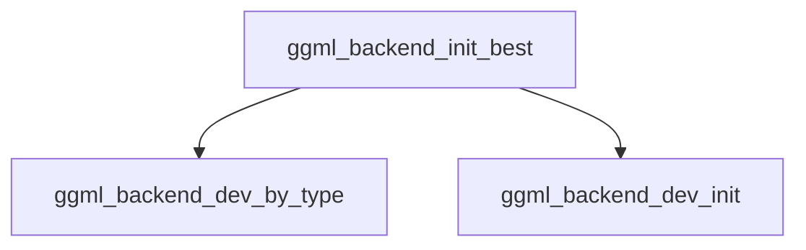

# `best_backend_selection` Module Documentation

## Introduction

The `best_backend_selection` module is a critical component within the GGML backend registration system, responsible for automatically determining and initializing the most suitable hardware backend for efficient computation. Its primary function is to prioritize GPU, then integrated GPU (iGPU), and finally CPU backends, ensuring optimal performance for GGML operations.

## Architecture and Core Functionality

This module centralizes the logic for identifying and activating the best available GGML backend based on a predefined hierarchy. It directly interfaces with backend device management utilities to query available hardware and initialize the selected one.

### `ggml_backend_init_best`

This is the core function of the `best_backend_selection` module. It systematically attempts to initialize a backend in the following order:

1.  **GPU Backend:** First, it tries to find and initialize a dedicated GPU backend.
2.  **iGPU Backend:** If no dedicated GPU is found, it then attempts to find and initialize an integrated GPU (iGPU) backend.
3.  **CPU Backend:** As a fallback, if neither a GPU nor an iGPU is available, it initializes a CPU backend.

If no suitable backend (GPU, iGPU, or CPU) can be found, the function returns a `nullptr`, indicating that no backend could be initialized.

### Component Relationships

The `ggml_backend_init_best` function relies on several external components to perform its task:

*   `ggml_backend_dev_by_type`: Used to query for available backend devices of a specific type (e.g., GPU, iGPU, CPU). This function is provided by the `backend_by_identifier` module.
*   `ggml_backend_dev_init`: Responsible for initializing the selected backend device. This function is part of the `backend_initialization_utilities` module.

## System Integration

The `best_backend_selection` module plays a pivotal role in the `ggml_backend_registration` system by providing the core mechanism for automatic backend selection. It acts as the initial entry point for applications requiring a GGML backend without explicit device specification, ensuring that the most capable hardware is utilized by default. It integrates seamlessly into the broader GGML ecosystem by leveraging common backend device management functions.

<!-- DIAGRAM_JSON
{
    "direction": "TD",
    "nodes": [
        {"id": "ggml_backend_init_best", "label": "ggml_backend_init_best", "type": "component", "link": null},
        {"id": "ggml_backend_dev_by_type", "label": "ggml_backend_dev_by_type", "type": "external", "link": "backend_by_identifier.md"},
        {"id": "ggml_backend_dev_init", "label": "ggml_backend_dev_init", "type": "external", "link": "backend_initialization_utilities.md"}
    ],
    "edges": [
        {"source": "ggml_backend_init_best", "target": "ggml_backend_dev_by_type"},
        {"source": "ggml_backend_init_best", "target": "ggml_backend_dev_init"}
    ],
    "groups": []
}
-->

