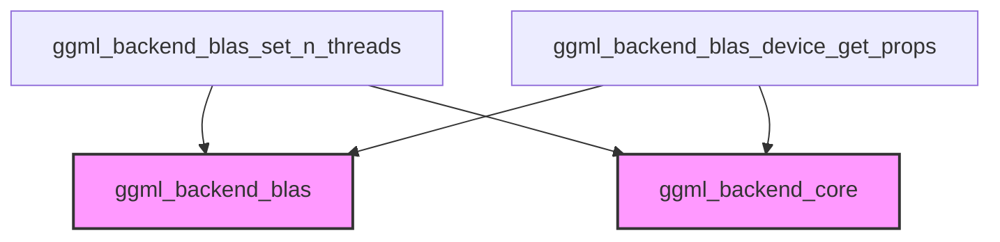

The `blas_backend_management` module is a crucial sub-component within the `ggml_backend_blas` module, responsible for managing the Basic Linear Algebra Subprograms (BLAS) backend's configuration and device properties. It provides essential functionalities for setting runtime parameters like the number of threads and retrieving detailed information about the BLAS-enabled devices available to the GGML framework. This module ensures that the BLAS backend can be effectively utilized and configured to optimize performance.

### Architecture and Component Relationships

The `blas_backend_management` module acts as a specialized interface for controlling the BLAS backend. Its components directly interact with the core `ggml_backend_blas` functionality to modify its operational parameters and query hardware capabilities. It relies on fundamental types and structures defined in `ggml_backend_core` for general backend and device abstractions, while leveraging BLAS-specific implementations from `ggml_backend_blas`.

#### Diagram

<!-- DIAGRAM_JSON
{
    "direction": "TD",
    "nodes": [
        {"id": "set_n_threads", "label": "ggml_backend_blas_set_n_threads", "type": "component", "link": null},
        {"id": "get_props", "label": "ggml_backend_blas_device_get_props", "type": "component", "link": null},
        {"id": "ggml_backend_blas_ext", "label": "ggml_backend_blas", "type": "external", "link": "ggml_backend_blas.md"},
        {"id": "ggml_backend_core_ext", "label": "ggml_backend_core", "type": "external", "link": "ggml_backend_core.md"}
    ],
    "edges": [
        {"source": "set_n_threads", "target": "ggml_backend_blas_ext"},
        {"source": "set_n_threads", "target": "ggml_backend_core_ext"},
        {"source": "get_props", "target": "ggml_backend_blas_ext"},
        {"source": "get_props", "target": "ggml_backend_core_ext"}
    ],
    "groups": []
}
-->

### Core Functionality

This module encapsulates two key functions:

1.  **`ggml_backend_blas_set_n_threads`**:
    *   **Purpose**: Configures the number of threads that the BLAS backend should utilize for its operations. This allows fine-tuning performance based on the underlying hardware and workload requirements.
    *   **Details**: It takes a `ggml_backend_t` instance (specifically a BLAS backend) and an integer `n_threads`. It asserts that the provided backend is indeed a BLAS backend and then updates the `n_threads` member within the backend's context.

2.  **`ggml_backend_blas_device_get_props`**:
    *   **Purpose**: Retrieves the properties of a specific BLAS backend device. This function provides crucial information about the device's capabilities and available resources.
    *   **Details**: Given a `ggml_backend_dev_t` (BLAS device), it populates a `ggml_backend_dev_props` structure with details such as the device's name, description, type, total and free memory, and various capabilities (e.g., asynchronous support, host buffer capabilities, buffer creation from host pointers, and event support). It leverages other `ggml_backend_blas` functions to obtain the specific name, description, type, and memory information.

### Integration with the Overall System

The `blas_backend_management` module is a leaf module within the `ggml_backend_blas` hierarchy, specifically nested under `backend_configuration_and_properties`. This placement signifies its role in providing granular control and information retrieval for the BLAS backend's configuration.

It serves as a low-level interface for higher-level backend management components to:
*   Dynamically adjust the threading for BLAS operations, which can be critical for performance tuning in applications using GGML.
*   Query device properties to make informed decisions about resource allocation, operation scheduling, and feature utilization.

The module's functions are called by other parts of the `ggml_backend_blas` to initialize, configure, and inspect the BLAS acceleration capabilities, ensuring that computations are offloaded and managed efficiently. It indirectly supports the broader `llama_cpp_common` and `ggml_core` modules by providing the underlying mechanisms for optimized matrix operations.

For more information on the overarching BLAS backend, refer to the [ggml_backend_blas documentation](ggml_backend_blas.md). For details on general backend concepts and types, consult the [ggml_backend_core documentation](ggml_backend_core.md).