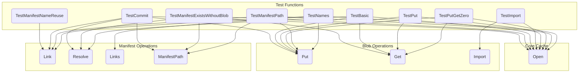

# blob_cache_management
This module manages a blob cache, handling storage and retrieval of content-addressable blobs, and linking them to manifest names. It supports operations like importing, linking, resolving, and listing cache entries.

<!-- DIAGRAM_JSON
{
  "nodes": [
    {"id": "A", "label": "TestManifestNameReuse", "group": "Test Functions"},
    {"id": "B", "label": "TestCommit", "group": "Test Functions"},
    {"id": "C", "label": "TestManifestExistsWithoutBlob", "group": "Test Functions"},
    {"id": "D", "label": "TestBasic", "group": "Test Functions"},
    {"id": "E", "label": "TestImport", "group": "Test Functions"},
    {"id": "F", "label": "TestPut", "group": "Test Functions"},
    {"id": "G", "label": "TestPutGetZero", "group": "Test Functions"},
    {"id": "H", "label": "TestManifestPath", "group": "Test Functions"},
    {"id": "I", "label": "TestNames", "group": "Test Functions"},
    {"id": "J", "label": "Open", "group": "Core Cache"},
    {"id": "K", "label": "Put", "group": "Blob Operations"},
    {"id": "L", "label": "Get", "group": "Blob Operations"},
    {"id": "M", "label": "Import", "group": "Blob Operations"},
    {"id": "N", "label": "Link", "group": "Manifest Operations"},
    {"id": "O", "label": "Resolve", "group": "Manifest Operations"},
    {"id": "P", "label": "Links", "group": "Manifest Operations"},
    {"id": "Q", "label": "ManifestPath", "group": "Manifest Operations"}
  ],
  "edges": [
    {"source": "A", "target": "N"},
    {"source": "B", "target": "J"},
    {"source": "B", "target": "N"},
    {"source": "B", "target": "K"},
    {"source": "B", "target": "O"},
    {"source": "B", "target": "Q"},
    {"source": "C", "target": "J"},
    {"source": "C", "target": "Q"},
    {"source": "C", "target": "O"},
    {"source": "C", "target": "L"},
    {"source": "D", "target": "J"},
    {"source": "D", "target": "O"},
    {"source": "D", "target": "L"},
    {"source": "D", "target": "K"},
    {"source": "E", "target": "J"},
    {"source": "E", "target": "M"},
    {"source": "F", "target": "J"},
    {"source": "F", "target": "K"},
    {"source": "F", "target": "L"},
    {"source": "G", "target": "J"},
    {"source": "G", "target": "K"},
    {"source": "G", "target": "L"},
    {"source": "H", "target": "J"},
    {"source": "H", "target": "K"},
    {"source": "H", "target": "N"},
    {"source": "H", "target": "Q"},
    {"source": "I", "target": "J"},
    {"source": "I", "target": "K"},
    {"source": "I", "target": "N"},
    {"source": "I", "target": "P"}
  ],
  "groups": [
    {"id": "Test Functions", "label": "Test Functions"},
    {"id": "Core Cache", "label": "Core Cache"},
    {"id": "Blob Operations", "label": "Blob Operations"},
    {"id": "Manifest Operations", "label": "Manifest Operations"}
  ]
}
-->
