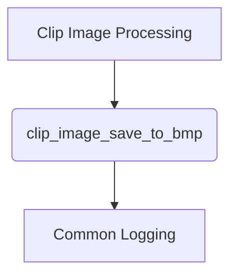

# BMP Conversion Module

## Introduction
The `bmp_conversion` module is responsible for converting raw image data into the BMP (Bitmap) image format and saving it to a specified file. It is a utility component within the broader image processing and output pipeline of the `llama_cpp_mtmd_clip` system.

## Architecture and Component Relationships

The `bmp_conversion` module contains the core logic for structuring and writing BMP files. It depends on an external image data structure, `clip_image_u8`, for input and a common logging utility.

<!-- DIAGRAM_JSON
{
    "direction": "TD",
    "nodes": [
        {"id": "clip_image_save_to_bmp", "label": "clip_image_save_to_bmp", "type": "component", "link": null},
        {"id": "clip_image_processing", "label": "Clip Image Processing", "type": "external", "link": "llama_cpp_mtmd_clip_clip_image_processing.md"},
        {"id": "common_logging", "label": "Common Logging", "type": "external", "link": "llama_cpp_common_common_logging.md"}
    ],
    "edges": [
        {"source": "clip_image_processing", "target": "clip_image_save_to_bmp"},
        {"source": "clip_image_save_to_bmp", "target": "common_logging"}
    ],
    "groups": []
}
-->

### Components

#### `clip_image_save_to_bmp`
This is the primary function within the `bmp_conversion` module. It takes an image represented by the `clip_image_u8` structure and a filename as input, then writes the image data to a BMP file.

**Core Functionality:**
-   **File Header Generation**: Constructs the 14-byte BMP file header, including the 'BM' signature and the total file size.
-   **Information Header Generation**: Creates the 40-byte `BITMAPINFOHEADER`, specifying image dimensions (width, height), color planes, bits per pixel (24-bit for this implementation), and compression type (none).
-   **Pixel Data Writing**: Iterates through the image pixels, writing them in BGR (Blue, Green, Red) format, which is standard for BMP files. Note that BMP stores pixels from bottom-to-top, so the function processes rows in reverse order (`img.ny - 1` down to `0`).
-   **Row Padding**: Adds necessary padding bytes at the end of each row to ensure that each row's data size is a multiple of 4 bytes, a requirement for BMP files.
-   **Error Handling**: Logs an error if the specified file cannot be opened for writing.

### Dependencies

-   **Input Data (`clip_image_u8`)**: The `clip_image_save_to_bmp` function expects image data in the `clip_image_u8` format, which is likely defined and populated by the [Clip Image Processing](llama_cpp_mtmd_clip_clip_image_processing.md) module. This structure is assumed to contain raw 8-bit per channel RGB pixel data along with image dimensions.
-   **Logging**: The module utilizes a `LOG_ERR` macro for error reporting, indicating a dependency on a [Common Logging](llama_cpp_common_common_logging.md) utility.

## Integration with Overall System

The `bmp_conversion` module is a specialized output handler within the `llama_cpp_mtmd_clip` multi-modal framework. After image data has been processed or generated by other `clip_image_processing` components, this module provides a way to persist that image data to disk in a standard BMP format. This is crucial for:
-   **Debugging**: Visualizing intermediate or final image outputs.
-   **Interoperability**: Providing image data in a format that can be easily consumed by other tools or applications.
-   **Archiving**: Saving processed images for later analysis or display.

It sits at the end of a typical image processing pipeline, taking the processed raster data and formatting it for external consumption.