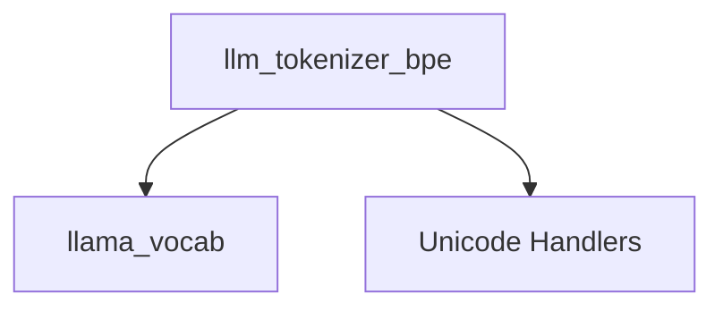

# bpe_tokenizer Module Documentation

## Introduction

The `bpe_tokenizer` module is a crucial component within the `llama_cpp_vocab.tokenizer_algorithms` submodule, specifically designed to handle the pre-tokenization phase for various Byte Pair Encoding (BPE) based language models. Its primary function is to break down raw text into initial segments (tokens) using a set of regular expressions tailored to different vocabulary preprocessing types. This initial segmentation prepares the text for subsequent BPE merging operations, which are essential for efficient and accurate tokenization in large language models.

## Core Functionality

The core of this module is the `llm_tokenizer_bpe` struct, which inherits from `llm_tokenizer`. Upon instantiation, `llm_tokenizer_bpe` determines the appropriate set of regular expressions (`regex_exprs`) based on the `LLAMA_VOCAB_PRE_TYPE` of the provided `llama_vocab` object. This flexible design allows the module to support a wide array of pre-tokenization schemes employed by different models, including:

*   **LLAMA3, DBRX, SMAUG, CHATGLM4**: Utilize a common regex pattern for general text, apostrophes, and special characters.
*   **DEEPSEEK_LLM, DEEPSEEK_CODER**: Employ specific regexes for handling newlines, various Unicode character blocks (letters, numbers), punctuation, and CJK characters.
*   **DEEPSEEK3_LLM, HUNYUAN_DENSE**: Combine number, CJK, and mixed character/punctuation patterns.
*   **FALCON**: Focuses on punctuation, common English contractions, and various character/number sequences.
*   **STARCODER, REFACT, COMMAND_R, SMOLLM, CODESHELL, EXAONE, MINERVA**: Emphasize numbers and standard contractions/character sequences.
*   **GPT2, MPT, OLMO, JAIS, TRILLION, GRANITE_DOCLING**: Use a general pattern similar to the above for contractions and character types.
*   **STABLELM2, QWEN2, HUNYUAN, GROK_2, SEED_CODER**: Incorporate numbers into a pattern similar to LLAMA3.
*   **PORO, BLOOM, GPT3_FINNISH, VIKING**: Utilize distinct patterns, often excluding specific punctuation, with VIKING also handling numbers.
*   **TEKKEN, GPT4O, MINIMAX_M2**: Feature complex regexes to differentiate between various Unicode letter types and handle contractions.
*   **KIMI_K2**: Triggers a custom handler in the [unicode_handlers](llama_cpp_unicode.md) module for specialized Han character exclusion.
*   **SUPERBPE**: Focuses on numbers and digit grouping patterns.
*   **BAILINGMOE**: Handles contractions and general character/number sequences, with a note on possessive quantifier handling.
*   **AFMOE**: Uses a custom digit handling implementation from [unicode_handlers](llama_cpp_unicode.md) and specific regexes for CJK/Asian scripts and general BPE patterns.

This dynamic selection of regular expressions ensures that the initial tokenization aligns precisely with the requirements of each specific model's vocabulary, leading to accurate subsequent BPE merging.

## Architecture and Component Relationships

The `bpe_tokenizer` module contains the `llm_tokenizer_bpe` component, which is responsible for the pre-tokenization logic.

<!-- DIAGRAM_JSON
{
    "direction": "TD",
    "nodes": [
        {"id": "llm_tokenizer_bpe", "label": "llm_tokenizer_bpe", "type": "component", "link": null},
        {"id": "llama_vocab", "label": "llama_vocab", "type": "external", "link": "llama_cpp_vocab.md"},
        {"id": "unicode_handlers", "label": "Unicode Handlers", "type": "external", "link": "llama_cpp_unicode.md"}
    ],
    "edges": [
        {"source": "llm_tokenizer_bpe", "target": "llama_vocab"},
        {"source": "llm_tokenizer_bpe", "target": "unicode_handlers"}
    ],
    "groups": []
}
-->

### Component Breakdown:

*   **`llm_tokenizer_bpe`**: This is the main component within this module. It inherits from `llm_tokenizer` (defined within the [llama_cpp_vocab](llama_cpp_vocab.md) module or its submodules) and contains the logic for selecting and applying pre-tokenization regular expressions.
*   **`llama_vocab` (External)**: The `llm_tokenizer_bpe` constructor depends on an instance of `llama_vocab` (from the [llama_cpp_vocab](llama_cpp_vocab.md) module). This object provides the `LLAMA_VOCAB_PRE_TYPE` which dictates which set of regular expressions should be used for pre-tokenization.
*   **`Unicode Handlers` (External)**: For specific vocabulary pre-types, such as `LLAMA_VOCAB_PRE_TYPE_KIMI_K2` and `LLAMA_VOCAB_PRE_TYPE_AFMOE`, the `llm_tokenizer_bpe` component delegates certain complex character handling to custom implementations found in the [llama_cpp_unicode](llama_cpp_unicode.md) module. This ensures correct processing of specialized character sets like Han characters or custom digit groupings.

## How it Fits into the Overall System

The `bpe_tokenizer` module is an integral part of the `llama.cpp` tokenization pipeline. It serves as the initial text processing stage for BPE-based models. Before any byte pair merges can occur, the input text must first be segmented into a sequence of smaller, manageable units. This module performs that crucial pre-segmentation, effectively preparing the input for the subsequent, more complex BPE encoding steps. By providing a highly configurable and model-specific pre-tokenization mechanism, `bpe_tokenizer` ensures compatibility and optimal performance across a diverse range of language models that utilize BPE tokenization.
