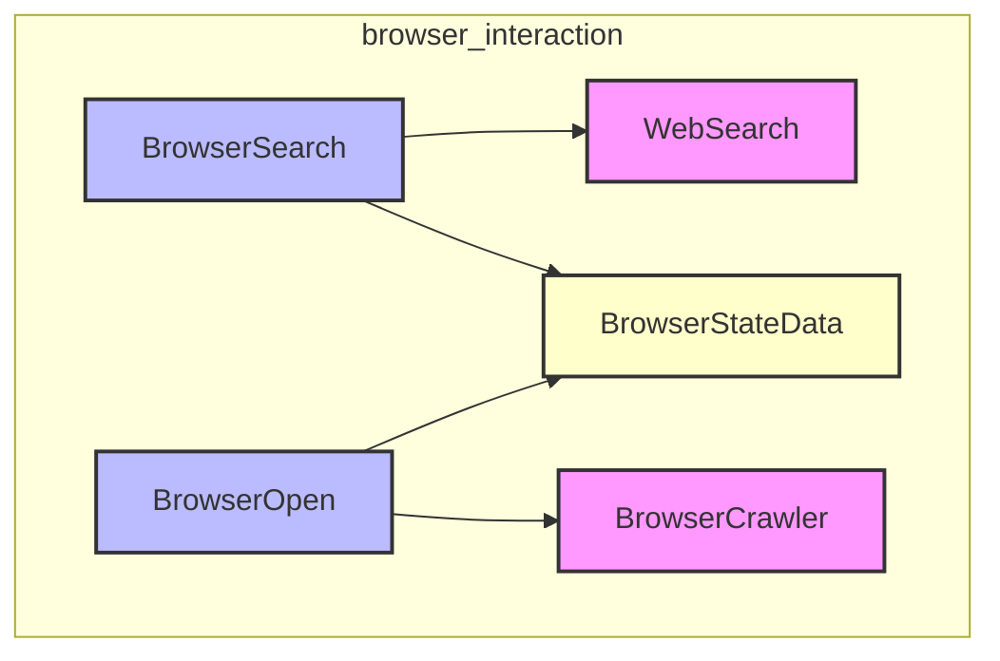

# browser_interaction
This module provides tools for browser-like interactions, including searching the web and opening specific URLs or links, while managing the browser's internal state and page cache.

<!-- DIAGRAM_JSON
{
  "nodes": [
    {"id": "BrowserSearch", "label": "BrowserSearch", "type": "tool"},
    {"id": "BrowserOpen", "label": "BrowserOpen", "type": "tool"},
    {"id": "BrowserCrawler", "label": "BrowserCrawler", "type": "dependency"},
    {"id": "WebSearch", "label": "WebSearch", "type": "dependency"},
    {"id": "BrowserStateData", "label": "BrowserStateData", "type": "data_store"}
  ],
  "edges": [
    {"source": "BrowserSearch", "target": "WebSearch", "label": "uses"},
    {"source": "BrowserSearch", "target": "BrowserStateData", "label": "modifies"},
    {"source": "BrowserOpen", "target": "BrowserCrawler", "label": "uses"},
    {"source": "BrowserOpen", "target": "BrowserStateData", "label": "reads/modifies"}
  ],
  "groups": [
    {"id": "browser_interaction", "label": "browser_interaction", "nodes": ["BrowserSearch", "BrowserOpen", "BrowserCrawler", "WebSearch", "BrowserStateData"]}
  ]
}
-->
