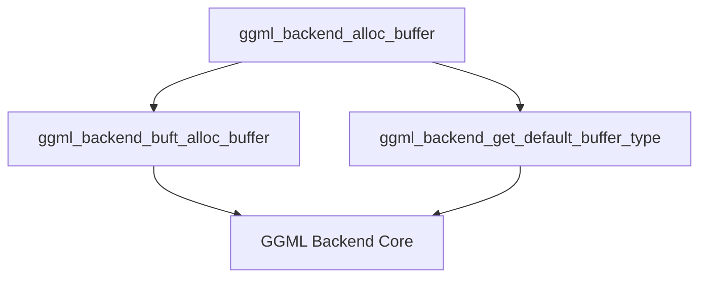

# buffer_allocation Module Documentation

## Introduction

The `buffer_allocation` module is a critical component within the `ggml_backend_core`'s memory management system. Its primary responsibility is to provide the fundamental mechanism for allocating memory buffers, serving as an interface to request and manage memory from various hardware backends (e.g., CPU, Metal, Vulkan).

This module ensures that operations within the GGML framework have access to appropriately sized and typed memory regions, abstracting away the complexities of backend-specific memory provisioning.

## Architecture and Component Relationships

The `buffer_allocation` module is a sub-module of `buffer_properties_and_allocation`, which is part of `buffer_management` under the `ggml_backend_core`. It exposes a core function, `ggml_backend_alloc_buffer`, which orchestrates the buffer allocation process.

`ggml_backend_alloc_buffer` depends on other functions within the `ggml_backend_core` to determine the correct buffer type and to perform the actual allocation. It calls `ggml_backend_get_default_buffer_type` to retrieve the appropriate buffer type for a given backend and then delegates the allocation request to `ggml_backend_buft_alloc_buffer`.

### Core Components

*   **`ggml_backend_alloc_buffer`**
    *   **Purpose:** The main entry point for buffer allocation in this module. It takes a backend instance and the desired size, then initiates the allocation using the backend's default buffer type.
    *   **Details:** This function acts as a high-level wrapper, simplifying the buffer allocation process for other parts of the GGML system.
    *   **Code:**
        ```cpp
        ggml_backend_buffer_t ggml_backend_alloc_buffer(ggml_backend_t backend, size_t size) {
            return ggml_backend_buft_alloc_buffer(ggml_backend_get_default_buffer_type(backend), size);
        }
        ```

### Dependencies

*   **`ggml_backend_get_default_buffer_type`**: A function (residing in [ggml_backend_core.md](ggml_backend_core.md)) responsible for determining the default buffer type associated with a given GGML backend.
*   **`ggml_backend_buft_alloc_buffer`**: A generalized buffer allocation function (also in [ggml_backend_core.md](ggml_backend_core.md)) that handles the actual memory provisioning based on the specified buffer type. It further delegates the allocation to the specific backend's interface (`buft->iface.alloc_buffer`).
*   **`ggml_backend_core`**: The overarching module that defines the backend interface, device management, and buffer type definitions necessary for this module's operation.

## How it Fits into the Overall System

The `buffer_allocation` module is a foundational piece of the GGML backend architecture. It provides the essential capability for dynamic memory allocation, enabling the creation and management of tensors and other data structures required for neural network computations. By abstracting the backend-specific allocation details, it contributes to the portability and flexibility of the GGML framework, allowing it to support various hardware accelerators without significant changes to the higher-level computational graph execution logic.

<!-- DIAGRAM_JSON
{
    "direction": "TD",
    "nodes": [
        {"id": "alloc_buffer", "label": "ggml_backend_alloc_buffer", "type": "component", "link": null},
        {"id": "buft_alloc_buffer", "label": "ggml_backend_buft_alloc_buffer", "type": "component", "link": null},
        {"id": "get_default_buffer_type", "label": "ggml_backend_get_default_buffer_type", "type": "component", "link": null},
        {"id": "ggml_backend_core", "label": "GGML Backend Core", "type": "external", "link": "ggml_backend_core.md"}
    ],
    "edges": [
        {"source": "alloc_buffer", "target": "buft_alloc_buffer"},
        {"source": "alloc_buffer", "target": "get_default_buffer_type"},
        {"source": "buft_alloc_buffer", "target": "ggml_backend_core"},
        {"source": "get_default_buffer_type", "target": "ggml_backend_core"}
    ],
    "groups": []
}
-->
