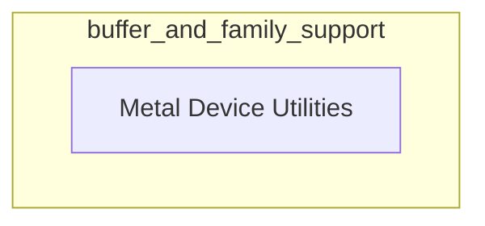

# Buffer and Family Support

The `buffer_and_family_support` module, located within `ggml_backend_metal.device_management`, provides essential functionalities for managing Metal device buffers and querying device family support. It acts as a foundational layer for understanding and interacting with the specific capabilities of Metal backend devices within the GGML framework.

## Architecture Overview

The `buffer_and_family_support` module encapsulates core utilities related to Metal device buffer types and device family compatibility checks. It primarily exposes the `metal_device_utilities` sub-module for these operations.

<!-- DIAGRAM_JSON
{
    "direction": "TD",
    "nodes": [
        {"id": "metal_device_utilities", "label": "Metal Device Utilities", "type": "module", "link": "metal_device_utilities.md"}
    ],
    "edges": [],
    "groups": []
}
-->

## Sub-modules

### [Metal Device Utilities](metal_device_utilities.md)
This sub-module provides functions to determine the buffer type (shared or private) for a Metal device and to check if a Metal backend supports a specific device family. These utilities are crucial for optimizing memory usage and ensuring compatibility with various Metal hardware configurations.