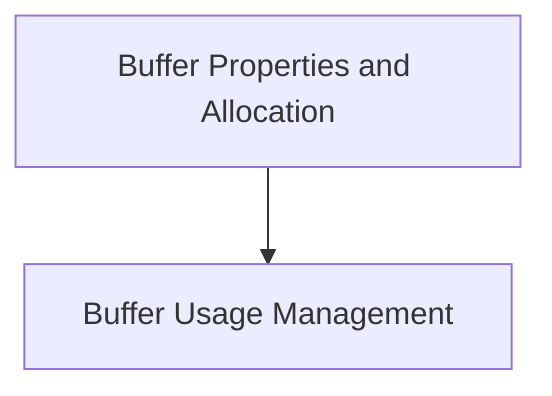

# Buffer Management Module

The `buffer_management` module in `ggml_backend_core` is responsible for handling memory buffer allocations, querying buffer properties, and managing buffer usage within the GGML backend. It provides essential functionalities for efficient memory handling for various backend implementations.

## Architecture Overview

The `buffer_management` module is composed of two primary sub-modules, each focusing on a distinct aspect of buffer handling:

<!-- DIAGRAM_JSON
{
    "direction": "TD",
    "nodes": [
        {"id": "buffer_properties_and_allocation", "label": "Buffer Properties and Allocation", "type": "module", "link": "buffer_properties_and_allocation.md"},
        {"id": "buffer_usage_management", "label": "Buffer Usage Management", "type": "module", "link": "buffer_usage_management.md"}
    ],
    "edges": [
        {"source": "buffer_properties_and_allocation", "target": "buffer_usage_management"}
    ],
    "groups": []
}
-->

## Sub-modules

### [Buffer Properties and Allocation](buffer_properties_and_allocation.md)
This sub-module focuses on the fundamental operations related to memory buffers, including their creation and the retrieval of their intrinsic properties. It provides functions to allocate new buffers through the default backend buffer type and to query attributes such as memory alignment requirements and the maximum permissible size for these buffers.

### [Buffer Usage Management](buffer_usage_management.md)
This sub-module is dedicated to defining and controlling how allocated memory buffers are utilized. It offers functionalities to specify the intended usage patterns for a given buffer, which allows the GGML backend to apply backend-specific optimizations based on the declared usage. This is crucial for optimizing performance and resource allocation.
