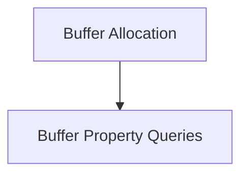

# Buffer Properties and Allocation Module

## Introduction
The `buffer_properties_and_allocation` module is a core component within the [ggml_backend_core](ggml_backend_core.md)'s buffer management system. It is responsible for defining and managing the properties of memory buffers used by the GGML backend, as well as handling their allocation. This module ensures efficient and correctly aligned memory allocation for various backend operations.

## Architecture Overview
This module is divided into two main sub-modules, each addressing a specific aspect of buffer management:

- [Buffer Allocation](buffer_allocation.md): Focuses on the creation and assignment of memory buffers.
- [Buffer Property Queries](buffer_property_queries.md): Provides utilities to retrieve essential information about allocated buffers, such as alignment and maximum size.

<!-- DIAGRAM_JSON
{
    "direction": "TD",
    "nodes": [
        {"id": "buffer_allocation", "label": "Buffer Allocation", "type": "module", "link": "buffer_allocation.md"},
        {"id": "buffer_property_queries", "label": "Buffer Property Queries", "type": "module", "link": "buffer_property_queries.md"}
    ],
    "edges": [
        {"source": "buffer_allocation", "target": "buffer_property_queries", "label": "provides/queries"}
    ],
    "groups": []
}
-->

## Sub-modules

### Buffer Allocation
This sub-module is responsible for the actual process of allocating memory buffers. It provides the core functionality to request and obtain buffer instances from the backend, ensuring they meet the specified size requirements.

For more details, refer to the [Buffer Allocation Documentation](buffer_allocation.md).

### Buffer Property Queries
This sub-module offers functions to query various properties of the allocated buffers and the backend itself. This includes retrieving information such as the required memory alignment for efficient access and the maximum allowable size for a buffer.

For more details, refer to the [Buffer Property Queries Documentation](buffer_property_queries.md).
