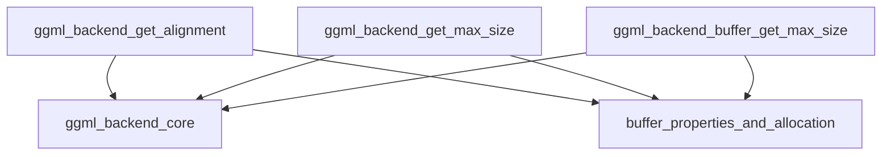

# buffer_property_queries Module Documentation

The `buffer_property_queries` module is a vital component within the `ggml_backend_core`'s buffer management system. It provides essential utility functions for querying various properties of backend buffers and buffer types, such as memory alignment requirements and maximum allocatable sizes. These queries are crucial for efficient memory allocation and management in the GGML backend, ensuring that operations can proceed with optimal performance and resource utilization.

## Core Functionality

This module encapsulates functions that allow other parts of the GGML backend to understand the characteristics of memory buffers provided by different hardware backends (e.g., CPU, Metal, Vulkan). By abstracting these queries, it promotes a cleaner separation of concerns and allows for flexible backend implementations without tightly coupling the memory allocation logic to specific backend details.

The primary functions in this module include:

*   **`ggml_backend_get_alignment`**: Queries the required memory alignment for the default buffer type of a specified GGML backend.
*   **`ggml_backend_get_max_size`**: Queries the maximum size that can be allocated for the default buffer type of a specified GGML backend.
*   **`ggml_backend_buffer_get_max_size`**: Queries the maximum size that can be allocated for a specific GGML backend buffer instance.

## Architecture and Component Relationships

The `buffer_property_queries` module acts as an interface for retrieving buffer-related properties. It relies on lower-level functions that operate directly on buffer types to get the actual property values.

<!-- DIAGRAM_JSON
{
    "direction": "TD",
    "nodes": [
        {"id": "get_alignment", "label": "ggml_backend_get_alignment", "type": "component", "link": null},
        {"id": "get_max_size", "label": "ggml_backend_get_max_size", "type": "component", "link": null},
        {"id": "buffer_get_max_size", "label": "ggml_backend_buffer_get_max_size", "type": "component", "link": null},
        {"id": "buft_properties", "label": "buffer_properties_and_allocation", "type": "external", "link": "buffer_properties_and_allocation.md"},
        {"id": "backend_core", "label": "ggml_backend_core", "type": "external", "link": "ggml_backend_core.md"}
    ],
    "edges": [
        {"source": "get_alignment", "target": "backend_core"},
        {"source": "get_alignment", "target": "buft_properties"},
        {"source": "get_max_size", "target": "backend_core"},
        {"source": "get_max_size", "target": "buft_properties"},
        {"source": "buffer_get_max_size", "target": "backend_core"},
        {"source": "buffer_get_max_size", "target": "buft_properties"}
    ],
    "groups": []
}
-->

### Component Breakdown

*   **`ggml_backend_get_alignment(ggml_backend_t backend)`**
    *   **Purpose**: Returns the memory alignment requirement for the default buffer type associated with the given `backend`. This is crucial for ensuring that allocated memory blocks are aligned correctly for optimal performance, especially in SIMD or GPU operations.
    *   **Dependencies**: It calls `ggml_backend_get_default_buffer_type` (likely from [ggml_backend_core.md](ggml_backend_core.md)) to get the buffer type and then `ggml_backend_buft_get_alignment` (likely from [buffer_properties_and_allocation.md](buffer_properties_and_allocation.md)) to get its alignment.

*   **`ggml_backend_get_max_size(ggml_backend_t backend)`**
    *   **Purpose**: Returns the maximum possible size, in bytes, that can be allocated by the default buffer type for the specified `backend`. This helps in capacity planning and preventing over-allocation errors.
    *   **Dependencies**: Similar to `ggml_backend_get_alignment`, it retrieves the default buffer type using `ggml_backend_get_default_buffer_type` (from [ggml_backend_core.md](ggml_backend_core.md)) and then queries its maximum size via `ggml_backend_buft_get_max_size` (from [buffer_properties_and_allocation.md](buffer_properties_and_allocation.md)).

*   **`ggml_backend_buffer_get_max_size(ggml_backend_buffer_t buffer)`**
    *   **Purpose**: Returns the maximum possible size, in bytes, that can be allocated by the specific `buffer` instance. This is useful when dealing with individual buffer objects that might have their own specific size constraints.
    *   **Dependencies**: It first determines the type of the given `buffer` using `ggml_backend_buffer_get_type` (likely from [ggml_backend_core.md](ggml_backend_core.md)) and then uses `ggml_backend_buft_get_max_size` (from [buffer_properties_and_allocation.md](buffer_properties_and_allocation.md)) to get the maximum size allowed for that buffer type.

## Integration with the Overall System

The `buffer_property_queries` module plays a foundational role in the GGML backend architecture, particularly in the [buffer_management](ggml_backend_core.md#buffer_management) sub-system of [ggml_backend_core](ggml_backend_core.md). It provides the necessary introspection capabilities for memory buffers, allowing higher-level modules to:

*   **Allocate memory efficiently**: By knowing the required alignment, memory allocators can ensure that buffers are correctly positioned in memory, avoiding performance penalties or errors due to misaligned access.
*   **Plan memory usage**: Understanding the maximum buffer sizes helps in determining if a particular operation or model can fit within the available memory constraints of a given backend.
*   **Support diverse backends**: Each backend (CPU, Metal, Vulkan, etc.) might have different memory characteristics. This module provides a unified interface to query these, allowing the rest of the system to remain backend-agnostic in its buffer property queries.

This module is a leaf module in the dependency graph, primarily serving the `buffer_properties_and_allocation` module and, by extension, the entire `ggml_backend_core` for robust and optimized memory handling.