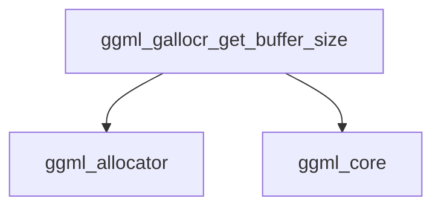

# Buffer Query Module

## Introduction

The `buffer_query` module provides functionality to query the size of memory buffers managed by the GGML graph allocator. Its primary role is to ensure accurate reporting of buffer sizes, particularly in scenarios where multiple buffer identifiers might refer to the same underlying memory block, preventing double-counting.

## Core Functionality

The `buffer_query` module contains the `ggml_gallocr_get_buffer_size` function, which is crucial for understanding the memory footprint of allocated graph buffers.

### `ggml_gallocr_get_buffer_size`

```c
size_t ggml_gallocr_get_buffer_size(ggml_gallocr_t galloc, int buffer_id);
```

This function retrieves the allocated size of a buffer identified by `buffer_id` within the `galloc` graph allocator context. It incorporates logic to handle situations where different `buffer_id` values might correspond to the same physical memory buffer, returning a size of `0` for subsequent references to avoid overstating memory usage. This is particularly relevant when a buffer type is reused across multiple allocations within the allocator.

#### Parameters

*   `galloc`: A pointer to the `ggml_gallocr_t` structure, representing the graph allocator.
*   `buffer_id`: An integer identifying the specific buffer whose size is to be queried.

#### Returns

Returns `size_t` representing the size of the specified buffer in bytes. If the `buffer_id` refers to a buffer that has already been counted (due to shared memory), it returns `0`.

#### Dependencies

*   **[ggml_allocator](ggml_allocator.md)**: Relies on the `ggml_gallocr_t` structure for graph allocator context.
*   **[ggml_core](ggml_core.md)**: Utilizes `ggml_vbuffer_size` to determine the actual size of a virtual buffer.

## Architecture Diagram
<!-- DIAGRAM_JSON
{
    "direction": "TD",
    "nodes": [
        {"id": "ggml_gallocr_get_buffer_size", "label": "ggml_gallocr_get_buffer_size", "type": "component", "link": null},
        {"id": "ggml_allocator", "label": "ggml_allocator", "type": "external", "link": "ggml_allocator.md"},
        {"id": "ggml_core", "label": "ggml_core", "type": "external", "link": "ggml_core.md"}
    ],
    "edges": [
        {"source": "ggml_gallocr_get_buffer_size", "target": "ggml_allocator"},
        {"source": "ggml_gallocr_get_buffer_size", "target": "ggml_core"}
    ],
    "groups": []
}
-->
