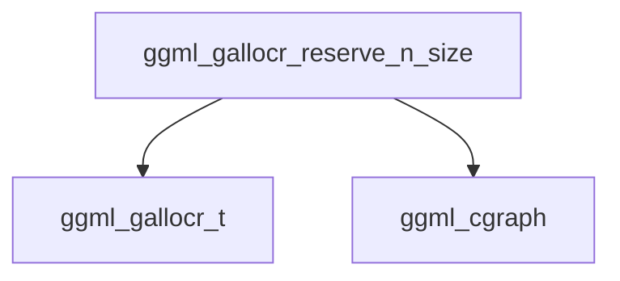

# buffer_reservation_and_sizing Module Documentation

## Introduction

The `buffer_reservation_and_sizing` module is a critical component within the `ggml_allocator` ecosystem, specifically responsible for determining and reserving the necessary memory footprint for computational graphs. This module ensures that memory buffers are adequately sized to accommodate all tensors and operations defined within a `ggml_cgraph` before computation begins, preventing out-of-memory errors and optimizing memory usage.

## Architecture and Core Functionality

This module primarily exposes a function to calculate the required sizes for various memory buffers based on a given computation graph. It acts as a sizing utility, performing a dry run of memory allocation to figure out the maximum memory needed without actually committing the memory.

### Core Component: `ggml_gallocr_reserve_n_size`

**Purpose:** This function calculates the total required memory size for each buffer managed by a `ggml_gallocr_t` allocator, given a `ggml_cgraph` and arrays specifying node and leaf buffer IDs. It does not perform actual memory allocation but rather computes the maximum potential size needed for each buffer during graph execution.

**Details:**
- It internally calls `ggml_gallocr_reserve_n_impl` with `no_alloc = true` to simulate the reservation process and determine sizes without allocating memory.
- It then iterates through all registered buffers within the `ggml_gallocr_t` instance.
- For each buffer, it sums up the `max_size` of all memory chunks associated with it, effectively determining the total capacity required.
- The calculated total sizes for all buffers are then stored in the provided `sizes` array.

```c
void ggml_gallocr_reserve_n_size(
        ggml_gallocr_t galloc, struct ggml_cgraph * graph, const int * node_buffer_ids, const int * leaf_buffer_ids, size_t * sizes) {
    GGML_ASSERT(ggml_gallocr_reserve_n_impl(galloc, graph, node_buffer_ids, leaf_buffer_ids, /*no_alloc =*/ true));
    for (int i = 0; i < galloc->n_buffers; i++) {
        sizes[i] = 0;
        for (int c = 0; c < galloc->buf_tallocs[i]->n_chunks; c++) {
            sizes[i] += galloc->buf_tallocs[i]->chunks[c]->max_size;
        }
    }
}
```

## Module Relationships

The `buffer_reservation_and_sizing` module is part of the `graph_allocation` sub-module within `ggml_allocator`. It depends on core `ggml` structures for graph representation and allocator management.

<!-- DIAGRAM_JSON
{
    "direction": "TD",
    "nodes": [
        {"id": "reserve_n_size", "label": "ggml_gallocr_reserve_n_size", "type": "component", "link": null},
        {"id": "gallocr_t", "label": "ggml_gallocr_t", "type": "external", "link": "ggml_allocator.md"},
        {"id": "cgraph", "label": "ggml_cgraph", "type": "external", "link": "ggml_core.md"}
    ],
    "edges": [
        {"source": "reserve_n_size", "target": "gallocr_t"},
        {"source": "reserve_n_size", "target": "cgraph"}
    ],
    "groups": []
}
-->



## How it Fits into the Overall System

This module plays a crucial role in the `ggml` backend by providing essential memory sizing information before the actual execution of a computation graph. By accurately predicting the maximum memory requirements, it enables efficient memory allocation strategies, especially in environments with constrained resources. It serves as a preparatory step, allowing the system to either pre-allocate memory or verify that sufficient memory is available, thus enhancing the stability and performance of `ggml`-based applications.
