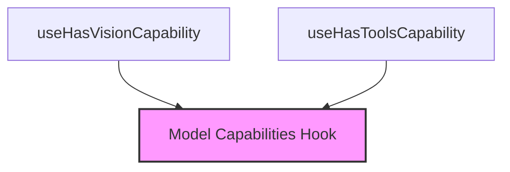

The `capability_checks` module provides a set of custom React hooks designed to determine specific capabilities (e.g., vision, tools) of a given model. By abstracting the underlying capability fetching logic, these hooks offer a clean and reusable way for UI components to conditionally render features or adjust behavior based on a model's supported functionalities.

### Core Functionality

This module contains two primary hooks:

*   `use_has_vision_capability`: Checks if the specified model possesses vision capabilities.
*   `use_has_tools_capability`: Checks if the specified model supports tool usage.

Both hooks rely on the `useModelCapabilities` hook from the `model_capabilities` module to retrieve the model's capabilities and then perform a simple inclusion check.

### Architecture and Component Relationships

The `capability_checks` module is a leaf module within the `app_ui_hooks.ui_utility_hooks.model_capabilities` hierarchy. It depends on its parent module, `model_capabilities`, to fetch the raw capability data for a given model.

<!-- DIAGRAM_JSON
{
    "direction": "TD",
    "nodes": [
        {"id": "use_has_vision_capability", "label": "useHasVisionCapability", "type": "component", "link": null},
        {"id": "use_has_tools_capability", "label": "useHasToolsCapability", "type": "component", "link": null},
        {"id": "model_capabilities", "label": "Model Capabilities Hook", "type": "external", "link": "model_capabilities.md"}
    ],
    "edges": [
        {"source": "use_has_vision_capability", "target": "model_capabilities"},
        {"source": "use_has_tools_capability", "target": "model_capabilities"}
    ],
    "groups": []
}
-->

### Integration with the Overall System

The `capability_checks` module fits into the overall system as a specialized UI utility. It provides easily consumable hooks for other UI components to query model capabilities without needing to directly interact with the `model_capabilities` data fetching logic. This promotes separation of concerns and improves the maintainability of the user interface, allowing different parts of the application to react appropriately to the presence or absence of specific model features. For instance, a chat input component might use `use_has_vision_capability` to enable an image upload button if the selected model supports vision.

For more details on how model capabilities are fetched, refer to the [model_capabilities documentation](model_capabilities.md).