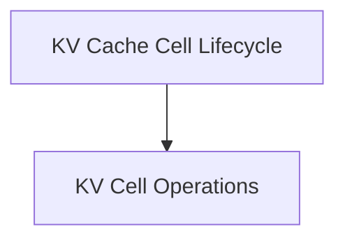

# Cell Management Module

## Introduction

The `cell_management` module is a critical component within the `llama_cpp_kv_cache` system, responsible for the lifecycle management of Key-Value (KV) cache cells. It provides fundamental operations for handling individual cells within the KV cache, ensuring efficient memory usage and proper sequence tracking for language model inference.

## Architecture

This module primarily focuses on low-level operations directly impacting the state of KV cache cells. It interacts closely with the broader `kv_cache_cell_lifecycle` module, which orchestrates the overall management of the cache.

<!-- DIAGRAM_JSON
{
    "direction": "TD",
    "nodes": [
        {"id": "cell_operations", "label": "KV Cell Operations", "type": "module", "link": "cell_operations.md"},
        {"id": "kv_cache_cell_lifecycle", "label": "KV Cache Cell Lifecycle", "type": "external", "link": "kv_cache_cell_lifecycle.md"}
    ],
    "edges": [
        {"source": "kv_cache_cell_lifecycle", "target": "cell_operations"}
    ],
    "groups": []
}
-->

## Sub-modules

### KV Cell Operations (`cell_operations.md`)

This sub-module encapsulates the core functions for managing individual KV cache cells, including mechanisms for keeping specific sequences and removing cells when they are no longer needed. It is essential for maintaining the integrity and efficiency of the KV cache during the generation process. For more details, refer to the [KV Cell Operations Documentation](cell_operations.md).