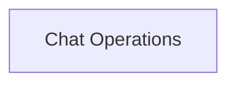

# Chat Lifecycle Management

The `chat_lifecycle_management` module is responsible for handling the various stages of a chat's existence within the application, from creation to deletion and modification. It provides essential hooks for managing chat entities, ensuring data consistency and a smooth user experience.

## Architecture Overview

The module leverages React hooks for managing chat-related mutations, interacting with the application's query client to ensure UI updates are synchronized with backend changes. It orchestrates actions like deleting and renaming chats, invalidating relevant queries to trigger data refetches and UI re-renders.

<!-- DIAGRAM_JSON
{
    "direction": "TD",
    "nodes": [
        {"id": "chat_operations", "label": "Chat Operations", "type": "module", "link": "chat_operations.md"}
    ],
    "edges": [],
    "groups": []
}
-->

## Sub-modules

### [Chat Operations](chat_operations.md)

This sub-module encapsulates the core functionalities for managing individual chat entities, including deletion and renaming operations. It leverages `react-query` hooks for efficient data management and UI synchronization.