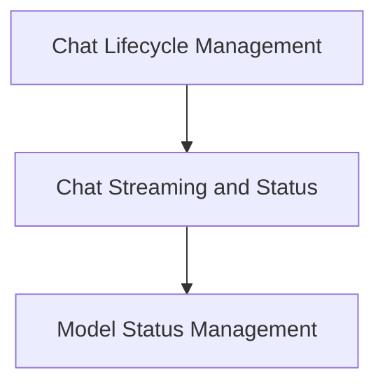

# Chat Management Hooks

The `chat_management_hooks` module provides a collection of React hooks designed to manage various aspects of chat interactions within the application. It centralizes logic for chat lifecycle, streaming status, and model-related UI concerns, ensuring a consistent and efficient user experience.

## Architecture Overview

The `chat_management_hooks` module is structured into several sub-modules, each focusing on a specific area of chat management. This modular approach enhances maintainability and allows for clear separation of concerns.

### Sub-modules:

*   **Chat Lifecycle Management**: Handles the core operations related to chat sessions, such as deletion and renaming. For more details, refer to [chat_lifecycle_management.md](chat_lifecycle_management.md).
*   **Chat Streaming and Status**: Manages real-time aspects of chat, including loading states, download progress, and the ability to cancel ongoing messages. For more details, refer to [chat_streaming_and_status.md](chat_streaming_and_status.md).
*   **Model Status Management**: Addresses UI concerns related to the status of models, such as displaying and dismissing warnings for stale models. For more details, refer to [model_status_management.md](model_status_management.md).

<!-- DIAGRAM_JSON
{
    "direction": "TD",
    "nodes": [
        {"id": "chat_lifecycle_management", "label": "Chat Lifecycle Management", "type": "module", "link": "chat_lifecycle_management.md"},
        {"id": "chat_streaming_and_status", "label": "Chat Streaming and Status", "type": "module", "link": "chat_streaming_and_status.md"},
        {"id": "model_status_management", "label": "Model Status Management", "type": "module", "link": "model_status_management.md"}
    ],
    "edges": [
        {"source": "chat_lifecycle_management", "target": "chat_streaming_and_status"},
        {"source": "chat_streaming_and_status", "target": "model_status_management"}
    ],
    "groups": []
}
-->
