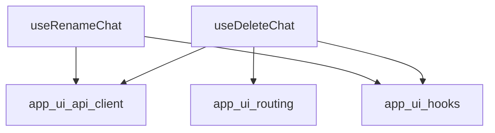

# chat_operations Module Documentation

## Introduction

The `chat_operations` module provides essential React hooks for managing the lifecycle of chat entities within the application's user interface. It encapsulates the core logic for performing operations such as deleting and renaming chats, ensuring a consistent and reactive user experience.

## Core Functionality

This module primarily exposes two hooks:

*   `useDeleteChat`: Manages the process of deleting a chat. Upon successful deletion, it handles UI navigation to prevent users from being on a deleted chat page and ensures the chat list is updated.
*   `useRenameChat`: Handles the renaming of an existing chat. It is responsible for triggering API calls to update the chat's title and subsequently invalidating relevant cached data to reflect the changes in the UI.

## Architecture and Component Relationships

The `chat_operations` module relies on other UI modules for API interaction, state management, and navigation. The hooks within this module orchestrate calls to the backend API via the `app_ui_api_client` and manage client-side state updates through `app_ui_hooks` (specifically `useQueryClient` from TanStack Query). Navigation changes are handled by `app_ui_routing`.

<!-- DIAGRAM_JSON
{
    "direction": "TD",
    "nodes": [
        {"id": "use_delete_chat", "label": "useDeleteChat", "type": "component", "link": null},
        {"id": "use_rename_chat", "label": "useRenameChat", "type": "component", "link": null},
        {"id": "app_ui_api_client", "label": "app_ui_api_client", "type": "external", "link": "app_ui_api_client.md"},
        {"id": "app_ui_hooks", "label": "app_ui_hooks", "type": "external", "link": "app_ui_hooks.md"},
        {"id": "app_ui_routing", "label": "app_ui_routing", "type": "external", "link": "app_ui_routing.md"}
    ],
    "edges": [
        {"source": "use_delete_chat", "target": "app_ui_api_client"},
        {"source": "use_delete_chat", "target": "app_ui_hooks"},
        {"source": "use_delete_chat", "target": "app_ui_routing"},
        {"source": "use_rename_chat", "target": "app_ui_api_client"},
        {"source": "use_rename_chat", "target": "app_ui_hooks"}
    ],
    "groups": []
}
-->

## How the module fits into the overall system

The `chat_operations` module is a critical part of the `app_ui_hooks.chat_management_hooks.chat_lifecycle_management` subtree. It provides the front-end logic for user-initiated chat modifications. By abstracting the API calls and UI state management into reusable hooks, it allows other UI components to easily integrate chat deletion and renaming functionalities without needing to manage the underlying complexities. It directly interacts with the backend through `app_ui_api_client` for data persistence and relies on `app_ui_hooks` for efficient data fetching and caching, as well as `app_ui_routing` for seamless navigation within the application.