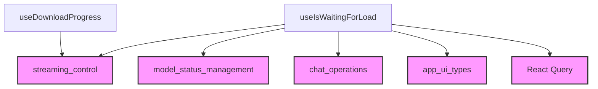

# chat_status_display Module Documentation

## Introduction

The `chat_status_display` module is responsible for providing hooks that manage and expose the current status of chat operations within the user interface. This includes determining if a chat is waiting for a model to load and tracking the download progress of chat-related assets. It plays a crucial role in enhancing the user experience by offering real-time feedback on chat states.

## Architecture and Component Relationships

The `chat_status_display` module contains two primary hooks: `useIsWaitingForLoad` and `useDownloadProgress`. These hooks interact with several external modules to gather necessary information about streaming contexts, selected models, chat data, and general UI types.

<!-- DIAGRAM_JSON
{
    "direction": "TD",
    "nodes": [
        {"id": "use_is_waiting_for_load", "label": "useIsWaitingForLoad", "type": "component", "link": null},
        {"id": "use_download_progress", "label": "useDownloadProgress", "type": "component", "link": null},
        {"id": "streaming_control", "label": "streaming_control", "type": "external", "link": "streaming_control.md"},
        {"id": "model_status_management", "label": "model_status_management", "type": "external", "link": "model_status_management.md"},
        {"id": "chat_operations", "label": "chat_operations", "type": "external", "link": "chat_operations.md"},
        {"id": "app_ui_types", "label": "app_ui_types", "type": "external", "link": "app_ui_types.md"},
        {"id": "react_query", "label": "React Query", "type": "external", "link": null}
    ],
    "edges": [
        {"source": "use_is_waiting_for_load", "target": "streaming_control"},
        {"source": "use_is_waiting_for_load", "target": "model_status_management"},
        {"source": "use_is_waiting_for_load", "target": "chat_operations"},
        {"source": "use_is_waiting_for_load", "target": "app_ui_types"},
        {"source": "use_is_waiting_for_load", "target": "react_query"},
        {"source": "use_download_progress", "target": "streaming_control"}
    ],
    "groups": []
}
-->

### Components

#### `useIsWaitingForLoad`

This hook determines if a specific chat is in a "waiting for load" state. A chat is considered to be waiting if it's currently streaming but the associated model hasn't finished loading. To avoid unnecessary loading indicators, it also checks if another recent chat used the same model within the last five minutes, in which case the loading state is suppressed.

**Key Functionality:**
-   Checks if a chat is actively streaming (`streamingChatIds`) but not yet marked as loaded (`loadingChats`).
-   Retrieves the currently selected model using `useSelectedModel` (see [model_status_management.md](model_status_management.md)).
-   Accesses chat information via `useChats` (see [chat_operations.md](chat_operations.md)) to evaluate recent chat activity.
-   Uses `useQueryClient` from React Query to access cached chat data, including messages and their associated models.
-   Filters out the "waiting for load" state if the same model was recently used in another chat, providing a smoother user experience.

#### `useDownloadProgress`

This hook provides the current download progress for a given chat ID. It directly retrieves this information from the `useStreamingContext` (see [streaming_control.md](streaming_control.md)), making it easy to display download status in the UI.

**Key Functionality:**
-   Accesses the `downloadProgress` map from the `useStreamingContext`.
-   Returns the download progress value associated with the specified `chatId`.

## How the Module Fits into the Overall System

The `chat_status_display` module is a vital part of the `app_ui_hooks` ecosystem, specifically within the `chat_streaming_and_status` section. It provides critical UI feedback mechanisms by leveraging data from chat management hooks, model status, and streaming contexts. By offering clear indicators of loading and download progress, it significantly improves the perceived responsiveness and usability of the chat application.

It depends on:
-   `streaming_control`: For information regarding streaming chats and download progress.
-   `model_status_management`: To understand which model is currently selected and used.
-   `chat_operations`: To access and analyze general chat information and message history.
-   `app_ui_types`: For shared type definitions like `Chat`.
-   `React Query`: For efficient data fetching and caching of chat data.