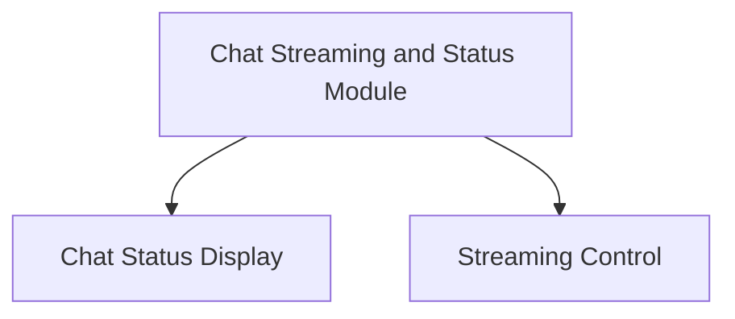

# Chat Streaming and Status Module

This module is responsible for managing the real-time streaming of chat messages and handling the display of their loading and download status within the user interface. It provides hooks to monitor the progress of messages, determine when a chat is waiting for content, and allows users to cancel ongoing message generation.

## Architecture Overview

The `chat_streaming_and_status` module is composed of two primary sub-modules:

1.  **[Chat Status Display](chat_status_display.md)**: Handles the logic for determining and presenting the loading and download progress of chat messages.
2.  **[Streaming Control](streaming_control.md)**: Provides the functionality to interrupt and cancel active message streams.

<!-- DIAGRAM_JSON
{
    "direction": "TD",
    "nodes": [
        {"id": "chat_status_display", "label": "Chat Status Display", "type": "module", "link": "chat_status_display.md"},
        {"id": "streaming_control", "label": "Streaming Control", "type": "module", "link": "streaming_control.md"}
    ],
    "edges": [
        {"source": "chat_streaming_and_status", "target": "chat_status_display"},
        {"source": "chat_streaming_and_status", "target": "streaming_control"}
    ],
    "groups": []
}
-->

## Sub-module Functionality

### Chat Status Display
This sub-module (`chat_status_display.md`) includes hooks like `useIsWaitingForLoad` which intelligently determines if a chat is in a loading state, considering various factors such as streaming status, model selection, and recent chat activity. It also provides `useDownloadProgress` to retrieve the current download progress for a specific chat, offering a granular view of content fetching.

### Streaming Control
This sub-module (`streaming_control.md`) encapsulates the `useCancelMessage` hook, which provides the critical functionality to abort an ongoing message generation. When a cancellation is triggered, it ensures that the associated `AbortController` is activated and all related state management, such as `streamingChatIds` and `downloadProgress`, is cleaned up efficiently, maintaining application responsiveness and data integrity.