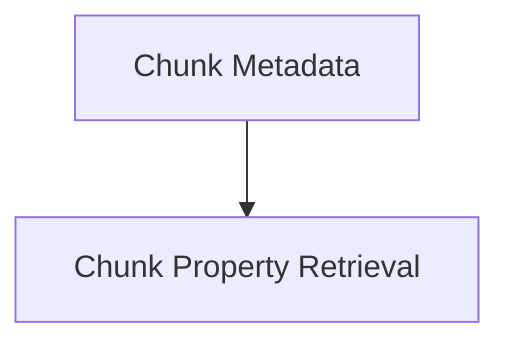

# Chunk Metadata

The `chunk_metadata` module is responsible for extracting essential metadata, such as token counts and positional information, from different types of input chunks (text, image, audio). This module is crucial for processing multi-modal inputs by providing a unified way to understand the size and structure of data segments.

## Architecture Overview
The `chunk_metadata` module primarily interacts with its `chunk_properties` sub-module to perform its core functions. It defines the interface for querying properties of various input chunk types, ensuring consistent data handling across the system.

<!-- DIAGRAM_JSON
{
    "direction": "TD",
    "nodes": [
        {"id": "chunk_properties", "label": "Chunk Property Retrieval", "type": "module", "link": "chunk_properties.md"}
    ],
    "edges": [
        {"source": "chunk_metadata", "target": "chunk_properties"}
    ],
    "groups": []
}
-->

## Module Functionality

*   **[Chunk Property Retrieval](chunk_properties.md)**: This sub-module contains functions to determine the number of tokens and positions within an input chunk, abstracting away the underlying chunk type (text, image, or audio).