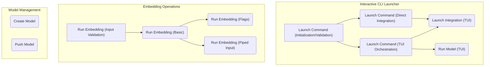

# cli_core_operations
Provides core command-line interface operations for managing, launching, and interacting with models and integrations, including interactive TUI flows and direct commands.

<!-- DIAGRAM_JSON
{
  "nodes": [
    {"id": "A", "label": "Launch Integration (TUI)"},
    {"id": "B", "label": "Run Model (TUI)"},
    {"id": "C", "label": "Run Embedding (Basic)"},
    {"id": "D", "label": "Run Embedding (Flags)"},
    {"id": "E", "label": "Run Embedding (Piped Input)"},
    {"id": "F", "label": "Run Embedding (Input Validation)"},
    {"id": "G", "label": "Create Model"},
    {"id": "H", "label": "Push Model"},
    {"id": "I", "label": "Launch Command (TUI Orchestration)"},
    {"id": "J", "label": "Launch Command (Direct Integration)"},
    {"id": "K", "label": "Launch Command (Initialization/Validation)"}
  ],
  "edges": [
    {"source": "K", "target": "I"},
    {"source": "K", "target": "J"},
    {"source": "I", "target": "A"},
    {"source": "I", "target": "B"},
    {"source": "J", "target": "A"},
    {"source": "F", "target": "C"},
    {"source": "C", "target": "D"},
    {"source": "C", "target": "E"}
  ],
  "groups": [
    {"id": "InteractiveCLI", "label": "Interactive CLI Launcher", "nodes": ["A", "B", "I", "J", "K"]},
    {"id": "EmbeddingOps", "label": "Embedding Operations", "nodes": ["C", "D", "E", "F"]},
    {"id": "ModelManagement", "label": "Model Management", "nodes": ["G", "H"]}
  ]
}
-->
